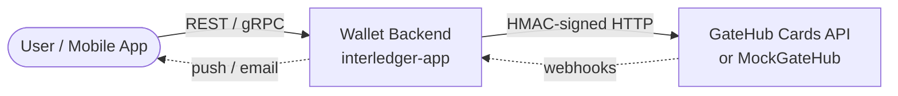
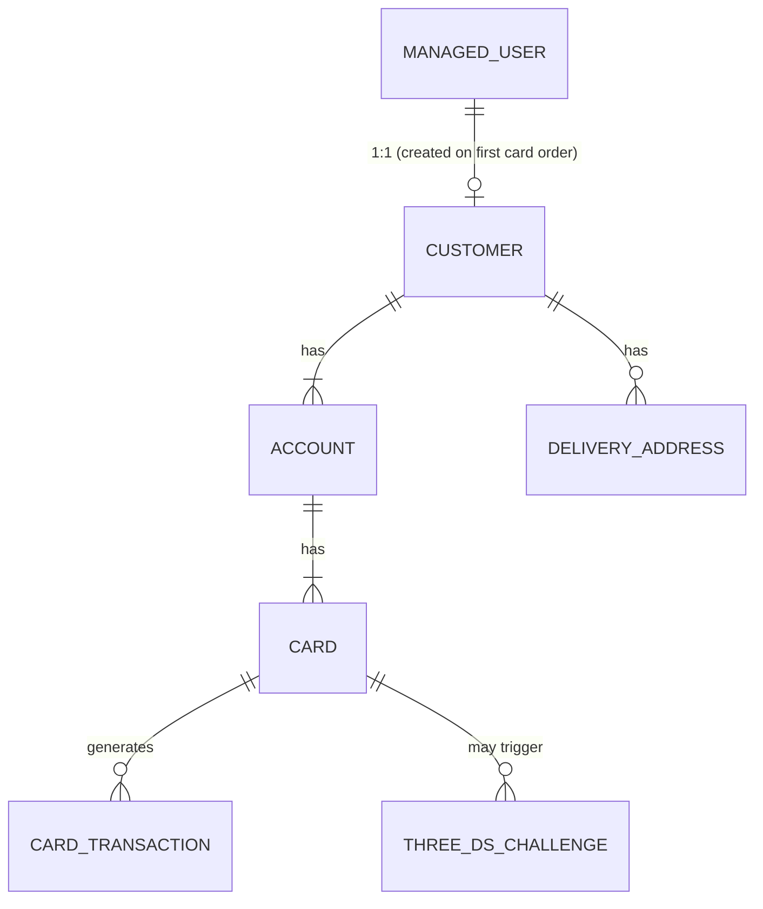
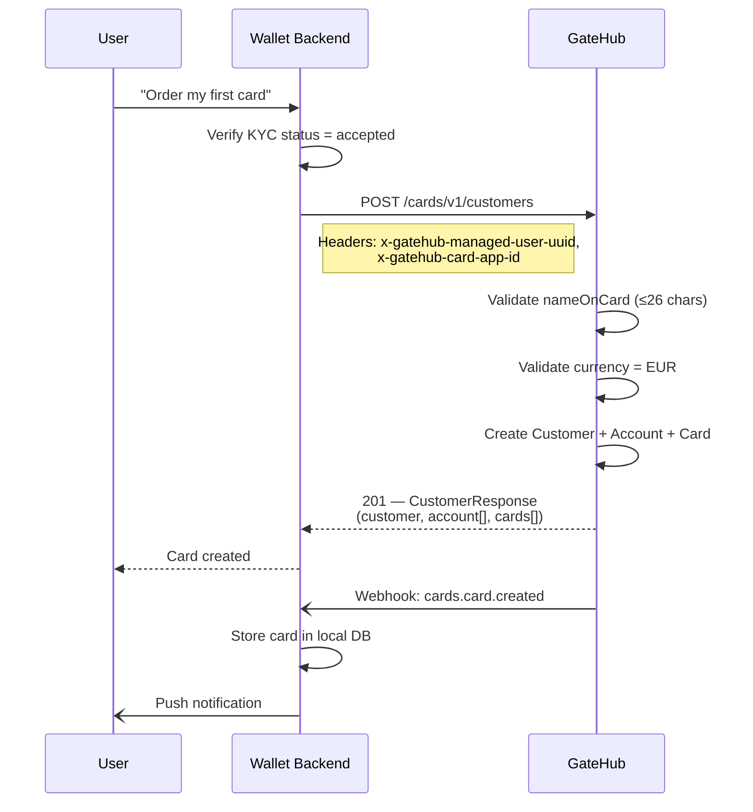
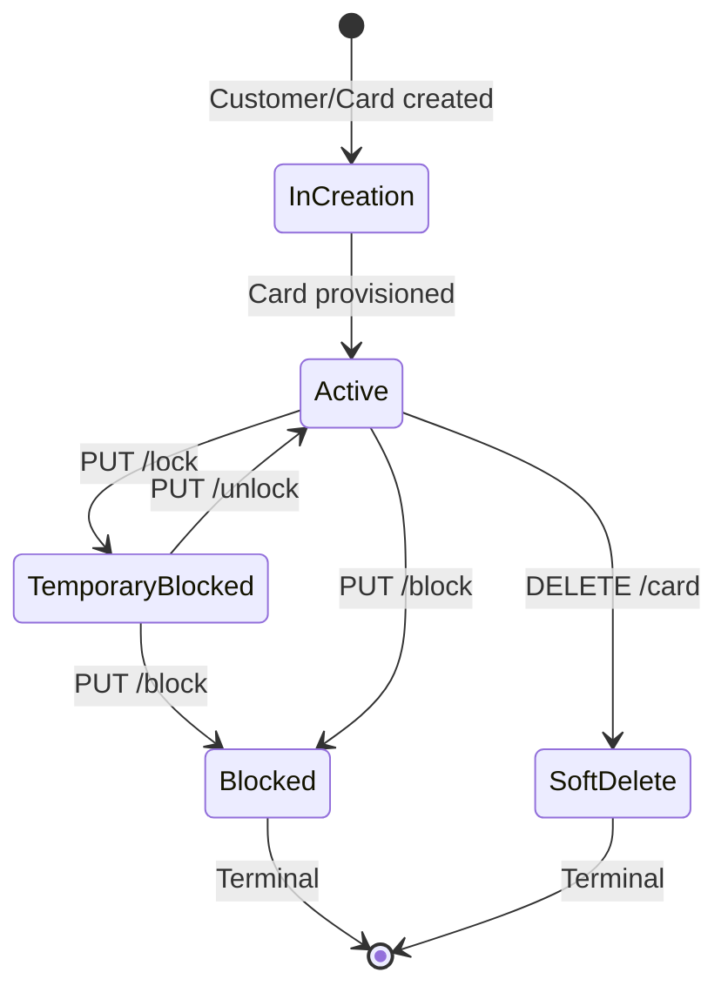
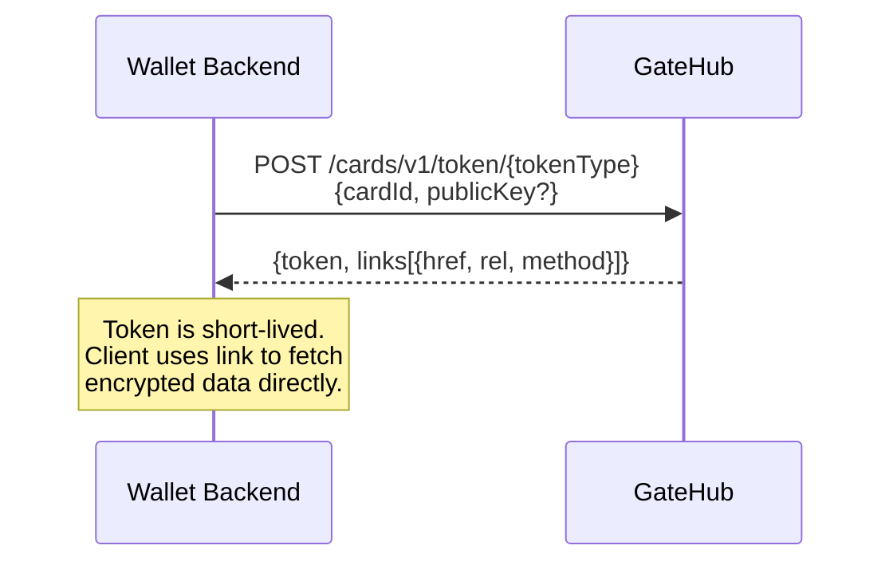
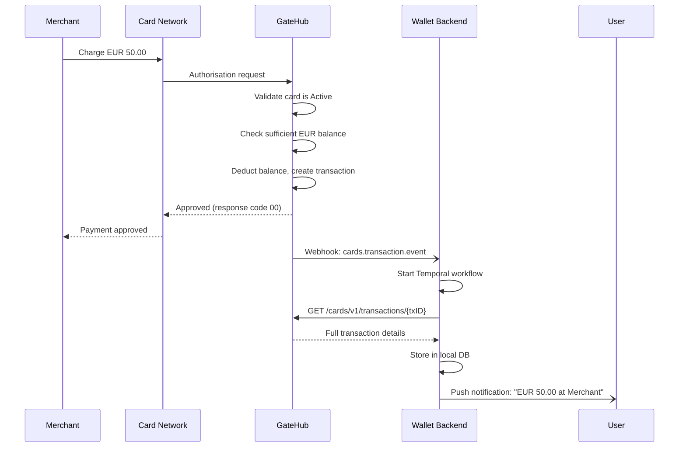
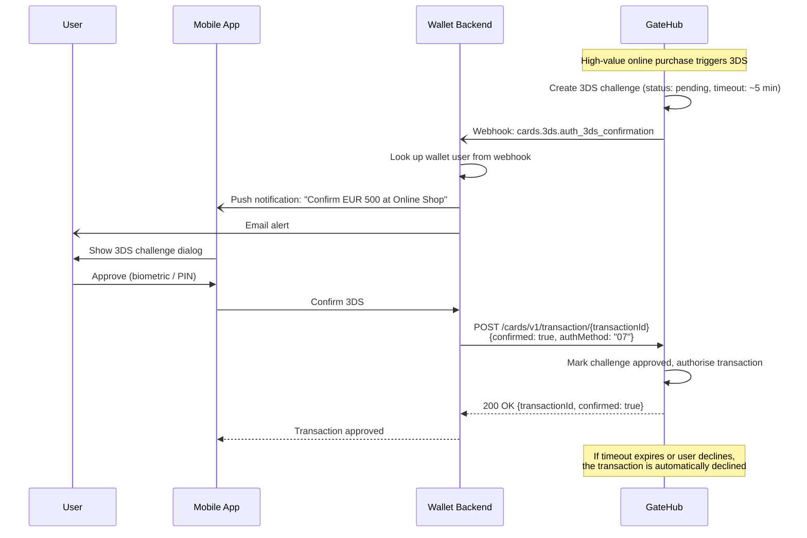

# GateHub Cards — How It Works

**Last Updated:** February 28, 2026

This document explains how GateHub's card issuing service integrates with the Interledger Wallet to give users EUR-denominated debit cards that draw from their wallet balances.

---

## Table of Contents

1. [System Overview](#1-system-overview)
2. [Authentication](#2-authentication)
3. [Entity Model](#3-entity-model)
4. [Customer Onboarding and First Card](#4-customer-onboarding-and-first-card)
5. [Card Management](#5-card-management)
6. [Card Status Lifecycle](#6-card-status-lifecycle)
7. [Delivery Addresses](#7-delivery-addresses)
8. [Physical Card (Plastic) Ordering](#8-physical-card-plastic-ordering)
9. [Card Tokens and Sensitive Data](#9-card-tokens-and-sensitive-data)
10. [Card Transactions](#10-card-transactions)
11. [3D Secure (3DS) Authentication](#11-3d-secure-3ds-authentication)
12. [Webhook Events](#12-webhook-events)
13. [Card Products](#13-card-products)
14. [API Endpoint Reference](#14-api-endpoint-reference)

---

## 1. System Overview

Three components participate in the card lifecycle:



**Wallet Backend** is the only component that talks to GateHub directly. It translates user-facing operations into GateHub API calls and processes asynchronous webhook events. All card state is ultimately owned by GateHub; the wallet backend maintains a local copy for fast reads.

**GateHub Cards API** (or its local mock, MockGateHub) handles customer creation, card issuing, transaction authorisation, and PIN/card-data tokenisation. It communicates results back through synchronous HTTP responses *and* asynchronous webhooks.

**EUR-only constraint:** All card accounts are denominated in EUR. This is enforced at customer creation time.

---

## 2. Authentication

Every request from the wallet backend to GateHub carries three headers:

| Header | Purpose |
|--------|---------|
| `x-gatehub-app-id` | Identifies the calling application |
| `x-gatehub-timestamp` | Unix timestamp of the request |
| `x-gatehub-signature` | HMAC-SHA256 signature for integrity |

The signature is computed as:

```
HMAC-SHA256(timestamp | method | full_url | body, app_secret)
```

Empty segments (e.g. no body on a GET) are stripped before signing.

Card-specific endpoints additionally require:

| Header | Purpose |
|--------|---------|
| `x-gatehub-card-app-id` | Card application identifier |
| `x-gatehub-managed-user-uuid` | Links the request to a specific wallet user |

The managed user must exist in GateHub and have completed KYC (`kycStatus = "accepted"`) before any card operations are permitted.

---

## 3. Entity Model

GateHub's card domain has a strict hierarchy:



**Managed User** — The wallet user's identity within GateHub. Created during KYC onboarding. Referenced by UUID in every card request header.

**Customer** — A card-programme customer. Created atomically with the first card order. Holds KYC status, delivery addresses, and one or more accounts. Has both an internal `id` (GateHub-generated) and a `sourceId` (the wallet user UUID).

**Account** — A EUR card account. Each account has a product code that determines card properties, limits, and pricing. Accounts hold one or more cards.

**Card** — A virtual or physical debit card. Identified by a card ID (prefixed `crd.` in production). Key attributes:
- `maskedPan` — BIN + last 4 digits (e.g. `512345******2346`)
- `nameOnCard` — Embossed name (max 26 characters)
- `status` — Active, TemporaryBlocked, Blocked, SoftDelete, InCreation, Pending
- `expiryDate` — Typically 3 years from creation
- `relationType` — PRIMARY (first card) or SECONDARY/Supplementary
- `isFirstTimeLock` / `plasticCreated` — Tracking flags

**Delivery Address** — A physical address for plastic card delivery. Types include PermanentResidence, Work, Other, TemporaryResidence.

**Card Transaction** — A purchase, ATM withdrawal, refund, or other card-initiated financial event.

**3DS Challenge** — A pending Strong Customer Authentication prompt requiring user approval before a transaction can proceed.

---

## 4. Customer Onboarding and First Card

The first card order is special: it atomically creates a Customer, an Account, and the initial Card in a single API call.



**Request body** includes:
- `walletAddress` — The user's wallet address
- `nameOnCard` — Cardholder name (required, max 26 chars)
- `account.productCode` — Determines card product (e.g. `PWSR_DEBP_2404`)
- `account.currency` — Must use EUR base currency. Accepts both `"EUR"` and prefixed variants like `"PW_EUR"` (where PW = Prepaid Wallet, a GateHub account type)
- `account.card.productCode` — Card product code
- `delivery` (optional) — Address for physical card delivery

### Currency Prefixes (PW_, DEB_, etc.)

GateHub uses prefixed currency codes to indicate the account type:

| Prefix | Meaning | Use Case |
|--------|---------|----------|
| `PW_` | Prepaid Wallet | Virtual card accounts with balance drawn from prepaid wallet |
| `DEB_` | Debit | Accounts linked to bank accounts |
| (none) | Base currency | Plain `EUR` without type prefix |

The Interledger backend typically sends `"PW_EUR"` to indicate prepaid wallet accounts. MockGateHub accepts all EUR-base variants (`EUR`, `PW_EUR`, `DEB_EUR`, etc.) and validates only that the base currency is EUR.

**Response** returns the full Customer object with nested accounts and cards, allowing the backend to extract all created entity IDs from a single response.

After responding, GateHub fires a `cards.card.created` webhook asynchronously. The backend processes this via a Temporal workflow to ensure reliable storage and user notification.

---

## 5. Card Management

### Listing Cards

```
GET /cards/v1/cards/{customerID}?pageSize=100
```

Returns all cards for a customer in a paginated response. Cards with status `SoftDelete` are excluded from the listing but remain in GateHub's system for audit.

### Getting Card Details

```
GET /cards/v1/cards/{cardID}/card
```

Returns full details for a single card including status, masked PAN, expiry, lock level, etc.

### Locking a Card (Temporary)

```
PUT /cards/v1/cards/{cardID}/lock?reasonCode=ClientRequestedLock
```

Temporarily blocks the card. The card cannot be used for transactions while locked but the action is reversible.

**Reason codes:** `ClientRequestedLock`, `LostCard`, `StolenCard`, `IssuerRequestGeneral`, `IssuerRequestFraud`, `IssuerRequestLegal`

An optional `note` field in the request body allows recording the reason.

The response returns the updated card with `status: "TemporaryBlocked"` and `lockLevel` set to the reason code.

### Unlocking a Card

```
PUT /cards/v1/cards/{cardID}/unlock
```

Reverses a temporary lock. Only valid when the card is in `TemporaryBlocked` status. Returns the card with `status: "Active"`.

### Permanently Blocking a Card

```
PUT /cards/v1/cards/{cardID}/block?reasonCode=LostCard
```

Permanently blocks a card. This action **cannot be undone**. The card remains visible in listings but can never be reactivated.

**Reason codes:** `LostCard`, `StolenCard`, `IssuerRequestGeneral`, `IssuerRequestFraud`, `IssuerRequestLegal`, `IssuerRequestIncorrectOpening`, `CardDamagedOrNotWorking`, `UserRequest`, `IssuerRequestCustomerDeceased`, `ProductDoesNotRenew`

### Closing a Card

```
DELETE /cards/v1/cards/{cardID}/card?reasonCode=UserRequest
```

Soft-deletes a card. The card becomes invisible in listings and cannot be used, but remains in GateHub's storage for audit. The wallet backend typically requires password confirmation before calling this.

**Reason codes:** `UserRequest`, `LostCard`, `StolenCard`

### Card Limits

```
GET  /cards/v1/cards/{cardID}/limits
POST /cards/v1/cards/{cardID}/limits
```

Cards have configurable spending limits. Limits are defined per type and currency:

```json
[
  {"type": "dailyOverall", "limit": 500, "currency": "EUR"},
  {"type": "dailyAtm", "limit": 200, "currency": "EUR", "isActive": true},
  {"type": "monthlyOverall", "limit": 5000, "currency": "EUR"}
]
```

The POST endpoint creates or overrides limits. Maximum limits are enforced based on the card's product code. If no limits are set, GateHub applies the maximum allowed defaults.

### Ordering Additional Cards

```
POST /cards/v1/cards/{accountID}/card
```

Orders a new card on an existing account. The new card shares the same EUR account but has its own card number, status, and limits.

---

## 6. Card Status Lifecycle

Cards move through well-defined states. Some transitions are reversible; others are terminal.



| Status | Transactions? | Reversible? | Visible in listings? |
|--------|:---:|:---:|:---:|
| `InCreation` | No | — | Yes |
| `Pending` | No | — | Yes |
| `Active` | Yes | — | Yes |
| `TemporaryBlocked` | No | Yes (unlock) | Yes |
| `Blocked` | No | No | Yes |
| `SoftDelete` | No | No | No |
| `AccountBlocked` | No | No | Yes |

**Validation rules:**
- A card cannot be locked if it is already `TemporaryBlocked`, `Blocked`, or `SoftDelete`
- A card can only be unlocked from `TemporaryBlocked` status
- Blocking is rejected if the card is already `Blocked` or `SoftDelete`
- Closing is rejected if the card is already `SoftDelete`

---

## 7. Delivery Addresses

Physical cards need a delivery address. GateHub maintains addresses per customer.

```
POST /cards/v1/customers/{customerID}/addresses
GET  /cards/v1/customers/{customerID}/addresses
```

**Creating an address** requires: `type` (Work, Other), `countryCode` (ISO 3166-1 alpha-3), `line1`, `city`, `zipCode`, and a `reason` explaining why a new address is needed.

**Listing addresses** returns all addresses, but only after the first card has been ordered. For the first card, the address provided during KYC (or in the creation request) is used as the primary.

Each address has a `status` (Active/Inactive), a `managedAddress` flag, and an optional `deliveryAddressUuid` that can be referenced in subsequent card orders.

---

## 8. Physical Card (Plastic) Ordering

After a virtual card exists, a physical plastic card can be ordered:

```
POST /cards/v1/cards/{cardID}/plastic
```

This triggers production and shipping of a physical card. The endpoint returns `204 No Content` on success. The card ID remains the same — the plastic is linked to the existing virtual card.

---

## 9. Card Tokens and Sensitive Data

Sensitive card data (full PAN, CVV, PIN) is never returned directly. Instead, a two-step token flow is used:



**Step 1 — Get a token:**

```
POST /cards/v1/token/{tokenType}
```

Request body:
```json
{
  "cardId": "card_...",
  "publicKey": "base64-encoded RSA PKCS#1 public key (optional, required for pin/card-data)"
}
```

Response:
```json
{
  "token": "jwt-or-opaque-token",
  "links": [
    {"href": "/cards/v1/proxy/clientDevice/cardData", "rel": "data", "method": "GET"}
  ]
}
```

**Token types used by the wallet backend:**

| Token Type | Purpose |
|------------|---------|
| `card-data` | Retrieve full PAN, CVV, expiry |
| `pin` | Retrieve encrypted PIN for display |
| `pin-change` | Obtain a token for changing the card PIN |
| `apple-provisioning` | Apple Pay wallet provisioning |
| `google-provisioning` | Google Pay wallet provisioning |
| `pai` | Digitalization PAI |

**Step 2 — Fetch encrypted data** (client-side, not used by the wallet backend):

```
GET /cards/v1/proxy/clientDevice/cardData   (Authorization: {token})
GET /cards/v1/proxy/clientDevice/pin         (Authorization: {token})
```

These proxy endpoints return data encrypted with the RSA public key provided in step 1. The wallet backend does not call these directly — it passes the token and link to the mobile app, which fetches the data client-side.

---

## 10. Card Transactions

### How Transactions Flow

When a user makes a purchase with their card, the flow traverses the card network back to GateHub:



The wallet backend does **not** initiate transactions — it only learns about them through webhooks and then fetches the full details.

### Retrieving Transactions

**Single transaction:**
```
GET /cards/v1/transactions/{transactionId}
```

**All transactions for a card** (paginated):
```
GET /cards/v1/cards/{cardId}/transactions?pageSize=20&pageNumber=1
```

### Transaction Fields

Key fields in a transaction response:

| Field | Description |
|-------|-------------|
| `transactionId` | Unique transaction identifier |
| `transactionAmount` / `transactionCurrency` | Amount in the transaction's original currency |
| `billingAmount` / `billingCurrency` | Amount in the card's billing currency (EUR) |
| `isTrxAmountConverted` | Whether currency conversion occurred |
| `type` | Transaction type (see table below) |
| `txStatus` | INITIAL, PROCESSING, ACQUIRED, COMPLETED, FAILED |
| `ghResponseCode` | ISO 8583 response code (`00` = approved, `51` = insufficient funds) |
| `merchantName`, `merchantCity`, `merchantCountry` | Merchant identification |
| `mcc` | Merchant Category Code |
| `entryMode` | How the card was presented (chip, contactless, online, etc.) |

**Transaction types:**

| Type | Meaning |
|------|---------|
| 0 | Purchase (POS or online) |
| 1 | ATM Withdrawal |
| 6 | Card Verification Inquiry |
| 17 | Cash Advance |
| 20 | Refund / Credit Payment |
| 30 | Balance Inquiry on ATM |
| 92 | PIN Change |
| 101 | Pre-authorisation |
| 103 | Pre-authorisation Completion |

---

## 11. 3D Secure (3DS) Authentication

3D Secure adds a second factor of authentication for card-not-present transactions (typically e-commerce). When a transaction requires 3DS, GateHub creates a challenge that the user must approve or decline within a timeout window.

### The 3DS Flow



### Listing Pending Challenges

```
GET /cards/v1/transaction/pending-confirmations
```

Returns all 3DS challenges for the user that are:
- Not yet confirmed or rejected
- Not expired

Response:
```json
{
  "pendingConfirmations": [
    {
      "transactionId": "62469058-d962-4f7c-a9c0-8c2a1b6efaa3",
      "merchantName": "Shop One Two",
      "purchaseAmount": "99.98",
      "purchaseCurrency": "EUR",
      "purchaseDate": "",
      "timeout": "300"
    }
  ]
}
```

The `timeout` field is the remaining time in seconds (as a string).

### Confirming or Declining

```
POST /cards/v1/transaction/{transactionId}
```

Request:
```json
{
  "confirmed": true,
  "authMethod": "07"
}
```

The `authMethod` field uses GateHub's enum values:
- `"07"` — FIDO / biometric authentication
- `"08"` — FIDO with transaction signing

Response:
```json
{
  "transactionId": "62469058-d962-4f7c-a9c0-8c2a1b6efaa3",
  "confirmed": true
}
```

Setting `confirmed: false` declines the transaction.

### Challenge Lifecycle

| Status | Meaning |
|--------|---------|
| `pending` | Awaiting user action |
| `approved` | User confirmed — transaction proceeds |
| `declined` | User rejected — transaction declined |
| `expired` | Timeout reached — transaction auto-declined |

Challenges that are approved, declined, or expired no longer appear in the `pending-confirmations` response.

---

## 12. Webhook Events

GateHub uses webhooks for asynchronous event notification. The wallet backend receives webhooks at a configured callback URL and processes them — typically via Temporal workflows for reliability.

### Webhook Envelope

Every webhook has the same outer structure:

```json
{
  "uuid": "...",
  "timestamp": "1768920404045",
  "event_type": "cards.card.created",
  "user_uuid": "...",
  "environment": "sandbox",
  "data": { ... }
}
```

Webhooks are signed with `HMAC-SHA256(json_body, hex_decoded_secret)` and delivered with an `x-gatehub-signature` header. The wallet backend validates this signature before processing.

### Delivery and Retries

Webhooks are delivered asynchronously with retry logic:
- Up to 10 delivery attempts
- 30-second fixed backoff between retries
- A configurable minimum delay before the first delivery attempt

### Card-Related Events

#### `cards.card.created`

Fired after a card is successfully created (either via customer creation or additional card order).

**Data payload:**
```json
{
  "cardId": "card_...",
  "cardSourceId": "card_...",
  "nameOnCard": "Alice Smith",
  "productCode": "PWSR_DEBP_2404",
  "maskedPan": "512345******2346",
  "accountId": "acc_...",
  "accountSourceId": "acc_...",
  "lockLevel": null,
  "customerId": "cust_...",
  "customerSourceId": "user_..."
}
```

**Backend processing:** Starts a `ProcessCardCreationWorkflow` Temporal workflow that stores the card in the wallet database and sends a push notification. Workflow ID includes the webhook UUID for idempotent deduplication.

#### `cards.transaction.event`

Fired when a card transaction occurs (purchase, ATM withdrawal, refund, etc.).

**Data payload:**
```json
{
  "title": "Card Purchase",
  "body": "EUR 50.00 at Coffee Shop",
  "transactionId": "tx_abc123",
  "cardId": "card_..."
}
```

**Backend processing:** Starts a `CreateCardTransaction` Temporal workflow. The workflow fetches the full transaction details via `GET /cards/v1/transactions/{txID}`, stores them, and sends a push notification using the `title` and `body` fields.

#### `cards.3ds.auth_3ds_confirmation`

Fired when a transaction requires 3D Secure user confirmation.

**Data payload:**
```json
{
  "type": "3ds_challenge",
  "payload": {
    "transactionId": "tx_3ds_001",
    "merchantName": "Online Retailer",
    "purchaseAmount": "150.00",
    "purchaseCurrency": "EUR",
    "purchaseDate": "2026-01-28T10:30:00Z",
    "timeout": "300"
  }
}
```

**Backend processing:** Processed synchronously (no Temporal workflow). Sends a push notification and email to the user prompting them to confirm or decline the transaction before the timeout.

---

## 13. Card Products

Before creating a card, the wallet backend queries available card products:

```
GET /cards/v1/card-applications/{appID}/card-products
```

Response includes product details such as:
- `code` — Product code (e.g. `PWSR_DEBP_2404`)
- `name` — Human-readable name (e.g. "Virtual Debit Card")
- `cost` — Card issuance cost
- `cardProductLimits` — Default and maximum spending limits per product

The product code is then referenced in customer creation and card ordering requests.

---

## 14. API Endpoint Reference

All card endpoints are under the `/cards/v1/` prefix.

### Customer & Onboarding

| Method | Path | Purpose |
|--------|------|---------|
| POST | `/customers` | Create customer + account + initial card |
| POST | `/customers/managed` | Create managed customer (alternative flow) |

### Card Lifecycle

| Method | Path | Purpose |
|--------|------|---------|
| GET | `/cards/{customerID}` | List all cards for a customer |
| GET | `/cards/{cardID}/card` | Get single card details |
| POST | `/cards/{accountID}/card` | Order additional card on existing account |
| PUT | `/cards/{cardID}/lock?reasonCode=...` | Temporarily lock card |
| PUT | `/cards/{cardID}/unlock` | Unlock card |
| PUT | `/cards/{cardID}/block?reasonCode=...` | Permanently block card |
| DELETE | `/cards/{cardID}/card?reasonCode=...` | Close (soft-delete) card |

### Card Limits

| Method | Path | Purpose |
|--------|------|---------|
| GET | `/cards/{cardID}/limits` | Get current spending limits |
| POST | `/cards/{cardID}/limits` | Create or override limits |

### Delivery Addresses

| Method | Path | Purpose |
|--------|------|---------|
| POST | `/customers/{customerID}/addresses` | Create new delivery address |
| GET | `/customers/{customerID}/addresses` | List delivery addresses |

### Plastic

| Method | Path | Purpose |
|--------|------|---------|
| POST | `/cards/{cardID}/plastic` | Order physical card |

### Tokens & Sensitive Data

| Method | Path | Purpose |
|--------|------|---------|
| POST | `/token/{tokenType}` | Get token for card-data, pin, pin-change, provisioning |

### Transactions

| Method | Path | Purpose |
|--------|------|---------|
| GET | `/transactions/{transactionId}` | Get single transaction |
| GET | `/cards/{cardId}/transactions` | List transactions for a card (paginated) |

### 3D Secure

| Method | Path | Purpose |
|--------|------|---------|
| GET | `/transaction/pending-confirmations` | List pending 3DS challenges |
| POST | `/transaction/{transactionId}` | Confirm or decline 3DS challenge |

### Card Products

| Method | Path | Purpose |
|--------|------|---------|
| GET | `/card-applications/{appID}/card-products` | List available card products |
