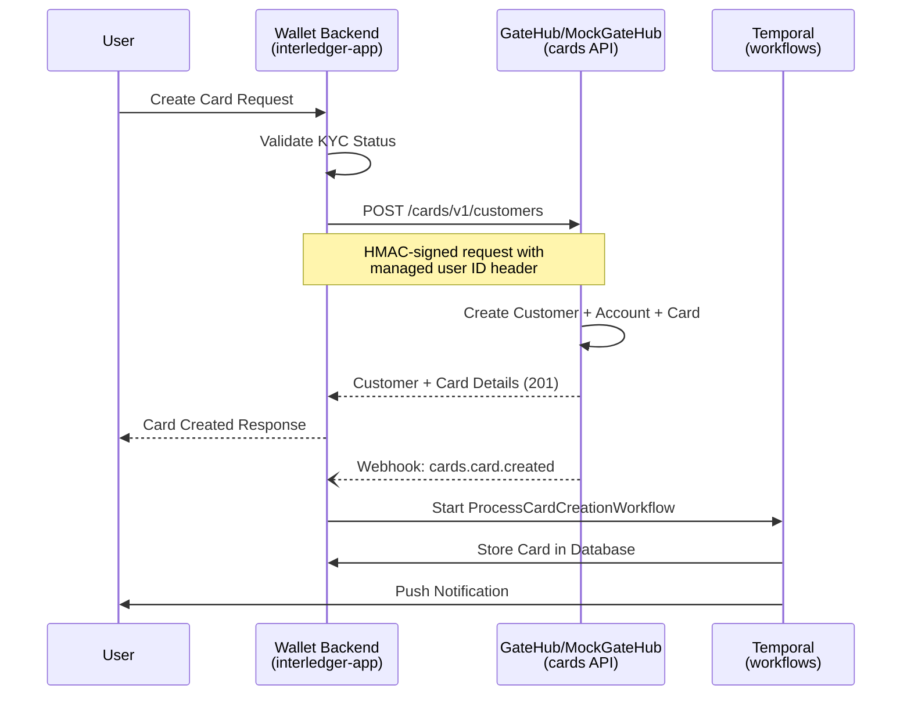
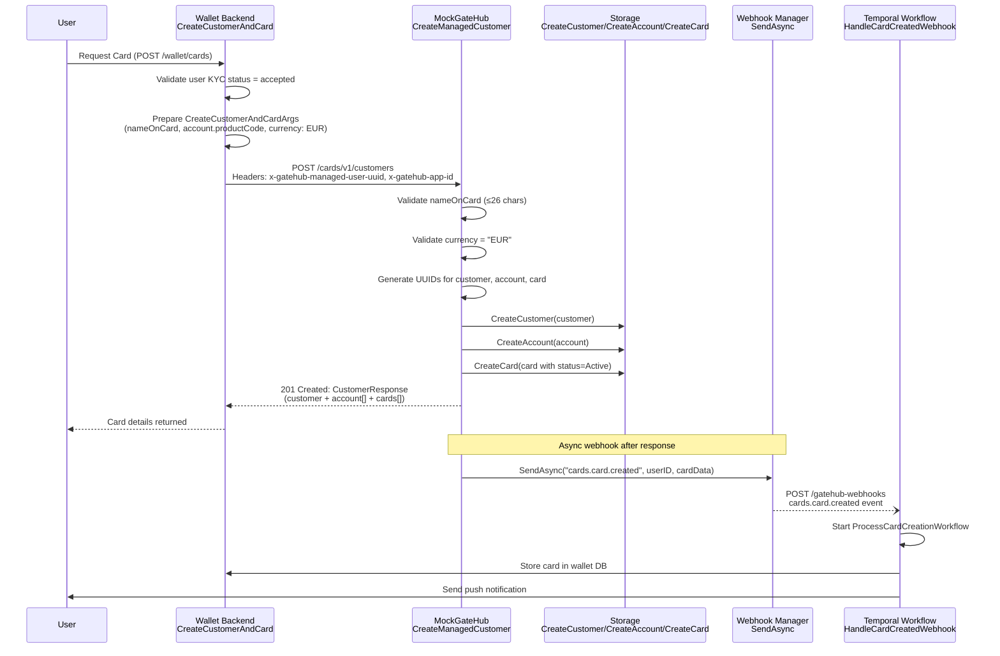
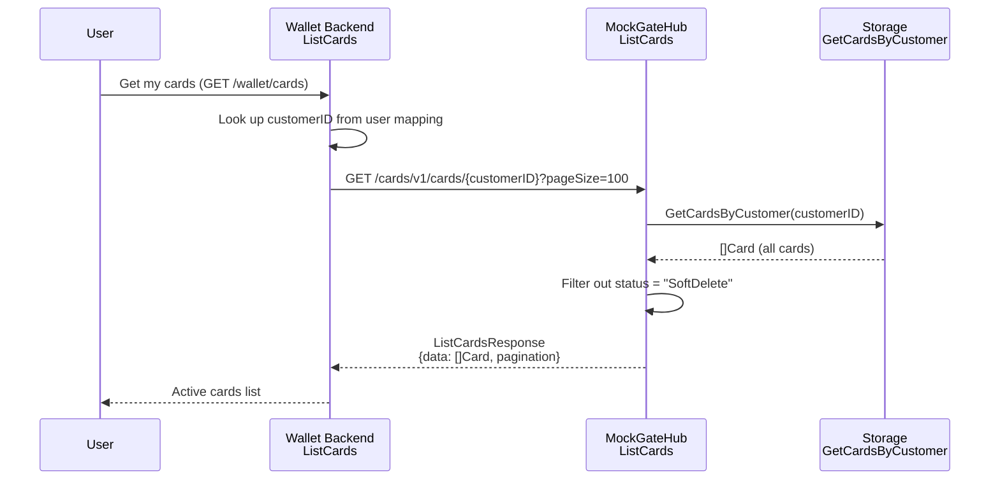
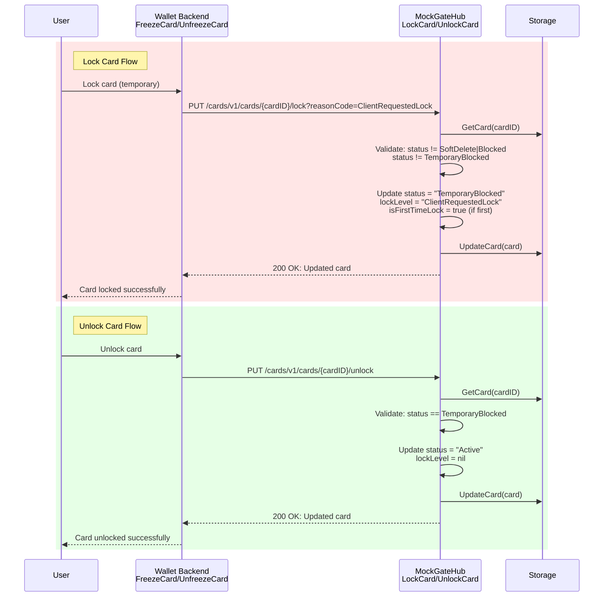
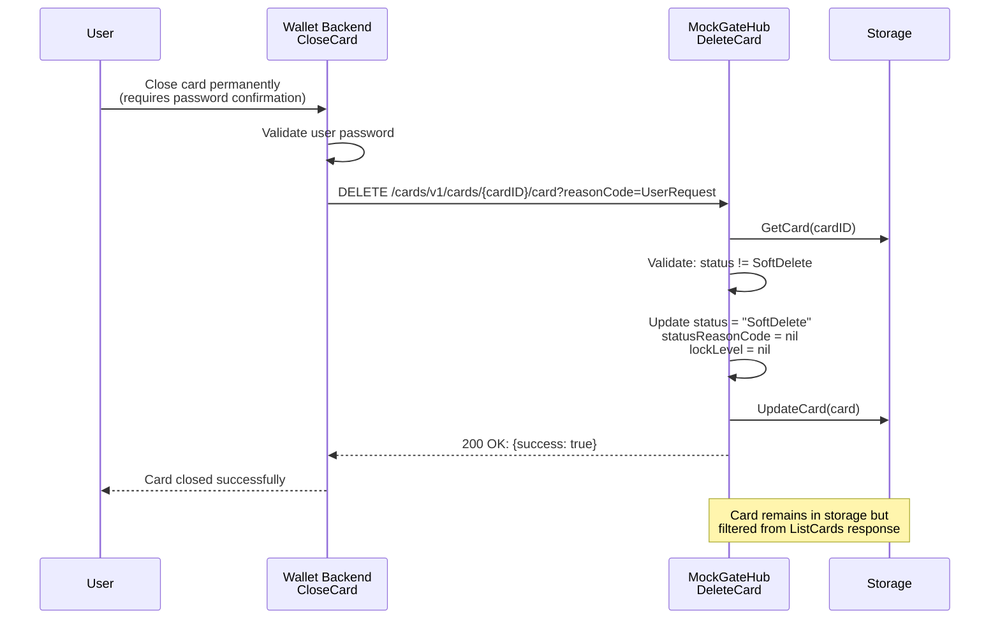
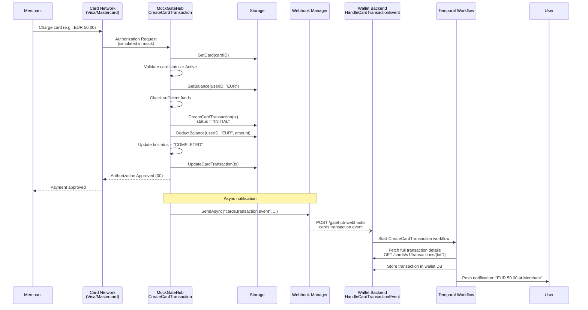
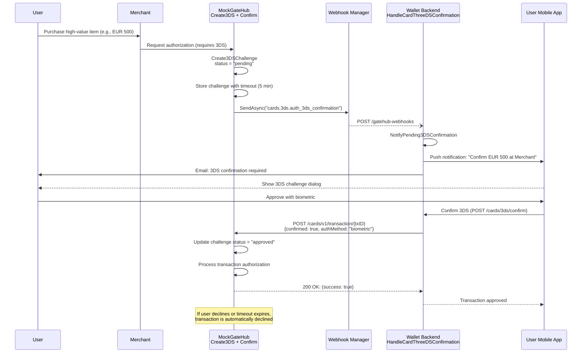
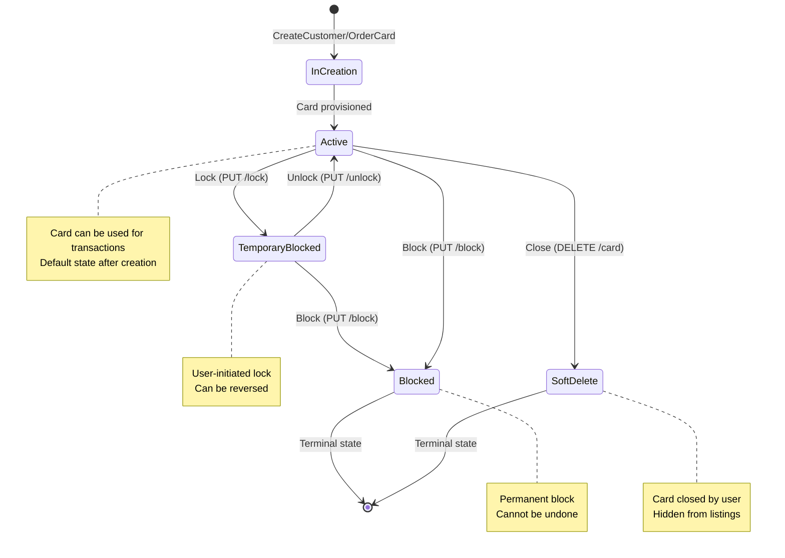
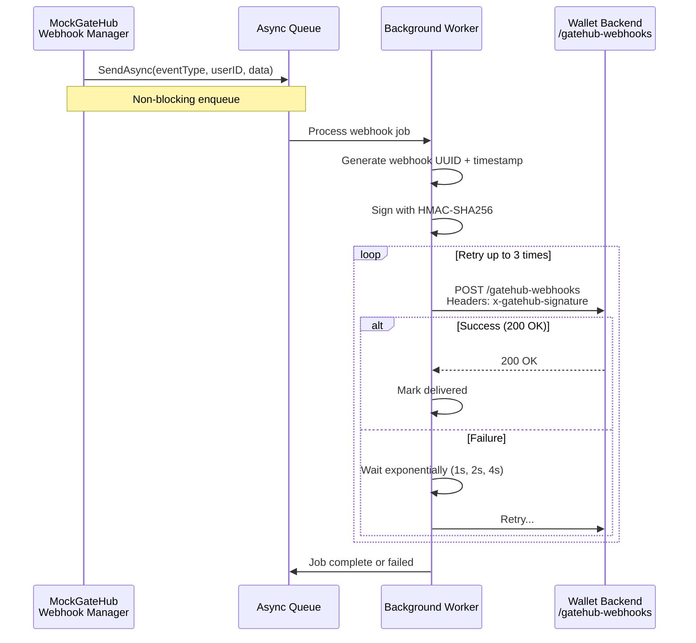

# GateHub Cards System Explainer

**Project:** Interledger App Wallet - Card Service Integration  
**Last Updated:** January 28, 2026  
**Purpose:** Technical documentation explaining how the GateHub Cards integration works in the Interledger Wallet ecosystem

---

## Overview

The GateHub Cards system enables Interledger Wallet users to order and manage EUR-denominated debit cards that draw from their wallet balances. This document explains how the complete card lifecycle works, from customer onboarding through transactions and webhooks.

### System Components

**Interledger Wallet Backend** (`interledger-app`)
- Go application handling user requests, card management, and business logic
- Located: `go/backend/providers/gatehub/`
- Functions as the GateHub API client

**MockGateHub** (`mockgatehub`)
- Local development replacement for GateHub Cards API
- Located: `internal/handler/cards.go` and `internal/storage/`
- Provides identical API responses for testing without external dependencies

**GateHub Cards API** (Production)
- Third-party card issuing service
- Provides EUR card accounts, virtual/physical cards, and transaction processing
- Webhook-based event notification system

---

## Table of Contents

1. [Architecture Overview](#architecture-overview)
2. [Card Lifecycle Workflows](#card-lifecycle-workflows)
3. [API Endpoints](#api-endpoints)
4. [Webhook Events](#webhook-events)
5. [Data Models](#data-models)
6. [Code References](#code-references)

---

## 1. Architecture Overview

### Request Flow



### Key Architectural Patterns

**HMAC Authentication**
- All requests signed using `x-gatehub-signature` header
- Signature format: `HMAC-SHA256(timestamp + method + path + body, secret)`
- Implemented in: `go/backend/providers/gatehub/external/client.go` (Sign method)

**Managed Users**
- Each wallet user has a corresponding "managed user" in GateHub
- Header `x-gatehub-managed-user-uuid` links requests to users
- MockGateHub validates user exists and has KYC status "accepted"

**Asynchronous Webhooks**
- Card creation, transactions, and 3DS challenges trigger webhooks
- Wallet backend processes webhooks via Temporal workflows
- Ensures eventual consistency and reliable event processing


---

## 2. Card Lifecycle Workflows

### 2.1 Customer and Initial Card Creation

This workflow creates a card customer, EUR account, and initial virtual card atomically.



**Code References:**
- **Wallet Backend Client:** `go/backend/providers/gatehub/external/cards.go` - `CreateCustomerAndCard(ctx, userID, args)` (lines ~194-253)
- **MockGateHub Handler:** `internal/handler/cards.go` - `CreateManagedCustomer(w, r)` (lines 20-207)
- **Webhook Handler:** `go/backend/providers/gatehub/ops/webhooks.go` - `HandleCardCreatedWebhook(ctx, b, raw, w)` (lines 212-256)

**Key Validations:**
- User must have `KYCState = "accepted"` (checked in MockGateHub line 42)
- `nameOnCard` limited to 26 characters (line 49-52)
- Only `currency: "EUR"` supported (lines 54-62)
- Creates customer, account, and card in single transaction

### 2.2 List and Retrieve Cards



**Code References:**
- **Wallet Backend:** `go/backend/providers/gatehub/external/cards.go` - `ListCards(ctx, userID, customerID)` (lines 15-72)
- **MockGateHub:** `internal/handler/cards.go` - `ListCards(w, r)` (lines 397-436)
- **Filter Logic:** Line 416-420 removes `SoftDelete` cards from response

**Important:** Cards with status `SoftDelete` are excluded from the list but remain in storage for audit purposes.

### 2.3 Lock and Unlock Card Workflow



**Code References:**
- **Wallet Backend Lock:** `go/backend/providers/gatehub/external/cards.go` - `FreezeCard(ctx, userID, cardID, args)` (lines 428-493)
- **Wallet Backend Unlock:** `go/backend/providers/gatehub/external/cards.go` - `UnfreezeCard(ctx, userID, cardID, args)` (lines 511-575)
- **MockGateHub Lock:** `internal/handler/cards.go` - `LockCard(w, r)` (lines 539-574)
- **MockGateHub Unlock:** `internal/handler/cards.go` - `UnlockCard(w, r)` (lines 576-601)

**Lock Reason Codes:**
- `ClientRequestedLock` - User requested temporary lock
- `LostCard` - Card lost (can be unlocked if found)
- `StolenCard` - Card stolen
- `IssuerRequestFraud` - Fraud suspicion

**State Validation:** Lock handler checks card status at lines 553-561, rejecting locks on closed or already-locked cards.

### 2.4 Close Card Workflow



**Code References:**
- **Wallet Backend:** `go/backend/providers/gatehub/external/cards.go` - `CloseCard(ctx, userID, cardID, args)` (lines 601-665)
- **MockGateHub:** `internal/handler/cards.go` - `DeleteCard(w, r)` (lines 644-669)

**Important:** This is a soft delete. The card:
- Changes status to `SoftDelete` (line 661)
- Clears `statusReasonCode` and `lockLevel` (lines 662-663)
- Remains in storage for audit/history
- No longer appears in `ListCards` response (filtered at line 416-420)

### 2.5 Card Transaction Flow



**Code References:**
- **Get Transaction (Backend):** `go/backend/providers/gatehub/external/cards.go` - `GetCardTransaction(ctx, userID, txID)` (lines 723-775)
- **Transaction Webhook Handler:** `go/backend/providers/gatehub/ops/webhooks.go` - `HandleCardTransactionEvent(ctx, b, raw, w)` (lines 366-410)
- **MockGateHub Create Transaction:** `internal/handler/cards.go` - `CreateCardTransaction(w, r)` (lines 827-955)

**Transaction Statuses:**
- `INITIAL` - Transaction created, pending authorization
- `PROCESSING` - Being processed by card network
- `COMPLETED` - Successfully authorized and settled
- `FAILED` - Declined (insufficient funds, blocked card, etc.)

**MockGateHub Transaction Creation** (internal testing endpoint):
- Simulates merchant transaction (lines 827-955)
- Validates card is active
- Deducts from EUR vault balance
- Sends webhook with transaction details

### 2.6 3D Secure Authentication Flow



**Code References:**
- **Get Pending Challenges (Backend):** `go/backend/providers/gatehub/external/cards.go` - `GetPendingThreeDSConfirmations(ctx, userID)` (lines 771-818)
- **Confirm 3DS (Backend):** `go/backend/providers/gatehub/external/cards.go` - `ThreeDSPaymentConfirmation(ctx, userID, args)` (lines 821-883)
- **3DS Webhook Handler:** `go/backend/providers/gatehub/ops/webhooks.go` - `HandleCardThreeDSConfirmation(ctx, b, raw, w)` (lines 412-451)
- **MockGateHub Confirm:** `internal/handler/cards.go` - `Confirm3DSPayment(w, r)` (lines 1081-1135)

**3DS Challenge Timeout:**
- Challenges expire after 5 minutes (configurable)
- Expired challenges automatically decline the transaction
- User notification includes urgency indicator

**Authentication Methods:**
- `biometric` - Fingerprint or Face ID
- `pin` - Card PIN
- `password` - User account password

### 2.7 Card Status State Machine

Cards transition through well-defined states:



**State Transition Validation:**
- Implemented in `internal/handler/cards.go`
- Lock: Rejects if status is `SoftDelete`, `Blocked`, or already `TemporaryBlocked` (lines 553-561)
- Unlock: Rejects if status is not `TemporaryBlocked` (lines 590-593)
- Block: Rejects if already `SoftDelete` or `Blocked` (lines 622-630)
- Close: Rejects if already `SoftDelete` (lines 651-654)

**Terminal States:**
- `Blocked` - Permanent, no further transitions allowed
- `SoftDelete` - Permanent, card hidden from active listings

---

## 3. API Endpoints

### Core Endpoints Summary

| Endpoint | Method | Purpose | Backend Function | MockGateHub Handler |
|----------|--------|---------|------------------|---------------------|
| `/cards/v1/customers` | POST | Create customer + card | `CreateCustomerAndCard` | `CreateManagedCustomer` |
| `/cards/v1/cards/{customerID}` | GET | List customer cards | `ListCards` | `ListCards` |
| `/cards/v1/cards/{cardID}/card` | GET | Get card details | `GetCardDetails` | `GetCard` |
| `/cards/v1/cards/{cardID}/card` | DELETE | Close card | `CloseCard` | `DeleteCard` |
| `/cards/v1/cards/{cardID}/lock` | PUT | Lock card | `FreezeCard` | `LockCard` |
| `/cards/v1/cards/{cardID}/unlock` | PUT | Unlock card | `UnfreezeCard` | `UnlockCard` |
| `/cards/v1/cards/{cardID}/block` | PUT | Block card (permanent) | `BlockCard` | `BlockCard` |
| `/cards/v1/cards/{accountID}/card` | POST | Order additional card | `OrderCard` | `OrderCard` |
| `/cards/v1/token/{tokenType}` | POST | Get secure token | `GetCardToken` | `GetCardToken` |
| `/cards/v1/transactions/{txID}` | GET | Get transaction | `GetCardTransaction` | `GetCardTransaction` |
| `/cards/v1/transaction/pending-confirmations` | GET | Get 3DS challenges | `GetPendingThreeDSConfirmations` | `GetPending3DSConfirmations` |
| `/cards/v1/transaction/{txID}` | POST | Confirm 3DS | `ThreeDSPaymentConfirmation` | `Confirm3DSPayment` |
| `/cards/v1/customers/{customerID}/addresses` | GET | List addresses | `GetDeliveryAddresses` | `GetDeliveryAddresses` |
| `/cards/v1/customers/{customerID}/addresses` | POST | Add address | `CreateCustomerDeliveryAddress` | `CreateCustomerDeliveryAddress` |

### 3.1 Create Customer and Initial Card

**Endpoint:** `POST /cards/v1/customers`

**Purpose:** Atomically creates card customer, EUR account, and initial virtual card.

**Headers:**
- `x-gatehub-managed-user-uuid`: Wallet user UUID (required)
- `x-gatehub-app-id`: Card application ID (required)
- `Content-Type: application/json`

**Request Body:**
```json
{
  "walletAddress": "https://ilp.link/alice",
  "nameOnCard": "Alice Smith",
  "account": {
    "productCode": "PWSR_DEBP_2404",
    "currency": "EUR",
    "card": {
      "productCode": "PWSR_DEBP_2404"
    }
  },
  "delivery": {
    "type": "HOME",
    "countryCode": "GBR",
    "line1": "123 Main Street",
    "city": "London",
    "zipCode": "SW1A1AA"
  }
}
```

**Response (201 Created):**
```json
{
  "walletAddress": "https://ilp.link/alice",
  "customers": {
    "id": "cust_550e8400-e29b-41d4-a716-446655440000",
    "sourceId": "user_770e8400-e29b-41d4-a716-446655440000",
    "type": "Citizen",
    "code": "CUST-550e8400",
    "kycStatus": "accepted",
    "accounts": [
      {
        "id": "acc_660e8400-e29b-41d4-a716-446655440000",
        "sourceId": "acc_660e8400-e29b-41d4-a716-446655440000",
        "productCode": "PWSR_DEBP_2404",
        "currency": "EUR",
        "type": "DEBIT",
        "status": "ACTIVE",
        "cards": [
          {
            "id": "card_770e8400-e29b-41d4-a716-446655440000",
            "sourceId": "card_770e8400-e29b-41d4-a716-446655440000",
            "nameOnCard": "Alice Smith",
            "productCode": "PWSR_DEBP_2404",
            "maskedPan": "512345******2346",
            "status": "Active",
            "expiryDate": "2029-01-28",
            "relationType": "PRIMARY"
          }
        ]
      }
    ]
  }
}
```

**Implementation:** `internal/handler/cards.go` - `CreateManagedCustomer(w, r)` (lines 20-207)

**Validation Logic:**
- User exists and `KYCState == "accepted"` (line 42)
- `nameOnCard` required and ≤ 26 chars (lines 45-52)
- `currency` must be "EUR" (lines 54-62)
- Delivery address validated if provided (lines 64-68)

**Post-Response Actions:**
- Sends `cards.card.created` webhook asynchronously (lines 197-207)

### 3.2 List Cards

**Endpoint:** `GET /cards/v1/cards/{customerID}?pageSize=100`

**Purpose:** Retrieve all active cards for a customer.

**Headers:**
- `x-gatehub-managed-user-uuid`: Required
- `x-gatehub-app-id`: Required

**Response (200 OK):**
```json
{
  "data": [
    {
      "id": "card_770e8400-e29b-41d4-a716-446655440000",
      "nameOnCard": "Alice Smith",
      "maskedPan": "512345******2346",
      "status": "Active",
      "expiryDate": "2029-01-28"
    }
  ],
  "pagination": {
    "pageNumber": 1,
    "pageSize": 100,
    "totalPages": 1
  }
}
```

**Implementation:** `internal/handler/cards.go` - `ListCards(w, r)` (lines 397-436)

**Filtering:** Excludes cards with `status == "SoftDelete"` (lines 416-420)

### 3.3 Lock/Unlock Card

**Lock Endpoint:** `PUT /cards/v1/cards/{cardID}/lock?reasonCode={code}`

**Reason Codes:**
- `ClientRequestedLock` - User-initiated
- `LostCard` - Card misplaced
- `StolenCard` - Card stolen
- `IssuerRequestFraud` - Suspected fraud

**Request Body (Optional):**
```json
{
  "note": "Locked while traveling"
}
```

**Response (200 OK):**
```json
{
  "id": "card_770e8400-e29b-41d4-a716-446655440000",
  "status": "TemporaryBlocked",
  "lockLevel": "ClientRequestedLock",
  "isFirstTimeLock": true
}
```

**Unlock Endpoint:** `PUT /cards/v1/cards/{cardID}/unlock`

**Response (200 OK):**
```json
{
  "id": "card_770e8400-e29b-41d4-a716-446655440000",
  "status": "Active",
  "lockLevel": null
}
```

**Implementation:**
- Lock: `internal/handler/cards.go` - `LockCard(w, r)` (lines 539-574)
- Unlock: `internal/handler/cards.go` - `UnlockCard(w, r)` (lines 576-601)

### 3.4 Get Card Token

**Endpoint:** `POST /cards/v1/token/{tokenType}`

**Token Types:**
- `card-data` - Access PAN, CVV, expiry
- `pin` - Access encrypted PIN
- `pin-change` - Token for changing PIN

**Request Body:**
```json
{
  "cardId": "card_770e8400-e29b-41d4-a716-446655440000",
  "publicKey": "optional_rsa_public_key_base64"
}
```

**Response (200 OK):**
```json
{
  "token": "mock-card-data-card_770e8400-...",
  "links": [
    {
      "href": "/cards/v1/token/card-data/data?token=...",
      "rel": "data",
      "method": "GET"
    }
  ]
}
```

**Implementation:** `internal/handler/cards.go` - `GetCardToken(w, r)` (lines 671-704)

**Security Note:** MockGateHub returns mock tokens. Production GateHub uses RSA encryption with provided public key.

### 3.5 Get Transaction

**Endpoint:** `GET /cards/v1/transactions/{transactionID}`

**Response (200 OK):**
```json
{
  "transactionId": "tx_abc123",
  "cardId": 123,
  "ghResponseCode": "00",
  "ghResponseDescription": "Approved",
  "transactionAmount": "50.00",
  "transactionCurrency": "EUR",
  "billingAmount": "50.00",
  "billingCurrency": "EUR",
  "type": 0,
  "txStatus": "COMPLETED",
  "merchantName": "Coffee Shop",
  "merchantCity": "London",
  "mcc": "5812",
  "createdAt": "2026-01-28T10:30:00Z"
}
```

**Transaction Types:**
- `0` - Purchase (POS or online)
- `1` - ATM Withdrawal
- `6` - Card Verification Inquiry
- `17` - Cash Advance
- `20` - Refund/Credit Payment

**Implementation:** `internal/handler/cards.go` - `GetCardTransaction(w, r)` (lines 989-1006)

---

## 4. Webhook Events

Webhooks enable asynchronous event-driven communication between GateHub/MockGateHub and the wallet backend.

### 4.1 Webhook Delivery Mechanism



**Implementation:** `internal/webhook/manager.go` (MockGateHub webhook system)

**Retry Logic:**
- Maximum 3 delivery attempts
- Exponential backoff: 1s, 2s, 4s
- Final failure logged but not re-queued

**Signature Generation:**
- Format: `HMAC-SHA256(timestamp + method + path + body, webhook_secret)`
- Header: `x-gatehub-signature`
- Validated by wallet backend before processing

### 4.2 Card Created Webhook

**Event Type:** `cards.card.created`

**Triggered:** After successful card creation (customer creation or additional card order)

**Payload:**
```json
{
  "uuid": "webhook_550e8400-e29b-41d4-a716-446655440000",
  "timestamp": "2026-01-28T10:30:00Z",
  "event_type": "cards.card.created",
  "user_uuid": "user_770e8400-e29b-41d4-a716-446655440000",
  "environment": "sandbox",
  "data": {
    "cardId": "card_770e8400-e29b-41d4-a716-446655440000",
    "cardSourceId": "card_770e8400-e29b-41d4-a716-446655440000",
    "nameOnCard": "Alice Smith",
    "productCode": "PWSR_DEBP_2404",
    "maskedPan": "512345******2346",
    "accountId": "acc_660e8400-e29b-41d4-a716-446655440000",
    "accountSourceId": "acc_660e8400-e29b-41d4-a716-446655440000",
    "lockLevel": null,
    "customerId": "cust_550e8400-e29b-41d4-a716-446655440000",
    "customerSourceId": "user_770e8400-e29b-41d4-a716-446655440000"
  }
}
```

**Wallet Backend Handler:** `go/backend/providers/gatehub/ops/webhooks.go` - `HandleCardCreatedWebhook(ctx, b, raw, w)` (lines 212-256)

**Processing Steps:**
1. Unmarshal webhook payload
2. Check if workflow already running (idempotency via workflow ID)
3. Start `ProcessCardCreationWorkflow` in Temporal
4. Workflow stores card in wallet database
5. Sends push notification to user

**Workflow ID:** `gatehub_card_created_webhook_{webhook.UUID}` (ensures deduplication)

**Reuse Policy:** `WORKFLOW_ID_REUSE_POLICY_REJECT_DUPLICATE` (prevents duplicate processing)

### 4.3 Card Transaction Event Webhook

**Event Type:** `cards.transaction.event`

**Triggered:** When a card transaction occurs (purchase, ATM withdrawal, refund)

**Payload:**
```json
{
  "uuid": "webhook_660e8400-e29b-41d4-a716-446655440000",
  "event_type": "cards.transaction.event",
  "timestamp": "2026-01-28T10:30:00Z",
  "user_uuid": "user_770e8400-e29b-41d4-a716-446655440000",
  "environment": "sandbox",
  "data": {
    "title": "Card Purchase",
    "body": "EUR 50.00 at Coffee Shop",
    "transactionId": "tx_abc123",
    "cardId": "card_770e8400-e29b-41d4-a716-446655440000"
  }
}
```

**Wallet Backend Handler:** `go/backend/providers/gatehub/ops/webhooks.go` - `HandleCardTransactionEvent(ctx, b, raw, w)` (lines 366-410)

**Processing Steps:**
1. Unmarshal webhook payload
2. Start `CreateCardTransaction` workflow
3. Workflow calls `GetCardTransaction(transactionId)` to fetch full details
4. Stores transaction in wallet database
5. Sends push notification using `title` and `body` fields from webhook

**Workflow ID:** `gatehub_card_transaction_event_{webhook.ID}`

**Reuse Policy:** `WORKFLOW_ID_REUSE_POLICY_TERMINATE_IF_RUNNING` (allows retry on failure)

### 4.4 3D Secure Confirmation Webhook

**Event Type:** `cards.3ds.auth_3ds_confirmation`

**Triggered:** When an e-commerce transaction requires 3D Secure authentication

**Payload:**
```json
{
  "uuid": "webhook_770e8400-e29b-41d4-a716-446655440000",
  "timestamp": "2026-01-28T10:30:00Z",
  "event_type": "cards.3ds.auth_3ds_confirmation",
  "user_uuid": "user_770e8400-e29b-41d4-a716-446655440000",
  "environment": "sandbox",
  "data": {
    "type": "3ds_challenge",
    "payload": {
      "transactionId": "tx_3ds_001",
      "merchantName": "Online Retailer",
      "purchaseAmount": "150.00",
      "purchaseCurrency": "EUR",
      "purchaseDate": "2026-01-28T10:30:00Z",
      "timeout": "2026-01-28T10:35:00Z"
    }
  }
}
```

**Wallet Backend Handler:** `go/backend/providers/gatehub/ops/webhooks.go` - `HandleCardThreeDSConfirmation(ctx, b, raw, w)` (lines 412-451)

**Processing Steps:**
1. Unmarshal webhook payload
2. Look up wallet ID from user UUID
3. Send push notification via `NotifyPending3DSConfirmation`
4. Send email alert via `SendPending3DSConfirmation`
5. User has until `timeout` to approve/decline

**No Temporal Workflow:** This webhook is processed synchronously (push + email only)

**User Action Required:** User must call `POST /cards/v1/transaction/{txID}` before timeout

---

## 5. Data Models

### 5.1 Core Entities

#### Customer

Represents a card-holding customer in the GateHub system.

**Structure:**
```json
{
  "id": "cust_550e8400-e29b-41d4-a716-446655440000",
  "sourceId": "user_770e8400-e29b-41d4-a716-446655440000",
  "type": "Citizen",
  "code": "CUST-550e8400",
  "taxNumber": "",
  "kycStatus": "accepted",
  "addresses": [],
  "accounts": []
}
```

**Fields:**
- `id` (string, UUID) - GateHub customer ID (generated)
- `sourceId` (string) - Wallet user UUID (external reference)
- `type` (string) - `"Citizen"` or `"LegalEntity"`
- `code` (string) - Short customer code (e.g., `"CUST-550e8400"`)
- `kycStatus` (string) - Mirrors wallet user KYC status (`"accepted"` required for cards)
- `addresses` (array) - Delivery addresses for physical cards
- `accounts` (array) - Card accounts (typically one EUR account)

**Storage Interface:** `internal/storage/interface.go` - `CreateCustomer`, `GetCustomer`, `UpdateCustomer`

**Created By:** `internal/handler/cards.go` - `CreateManagedCustomer` (lines 70-85)

#### Account

Represents a EUR card account that holds one or more cards.

**Structure:**
```json
{
  "id": "acc_660e8400-e29b-41d4-a716-446655440000",
  "sourceId": "acc_660e8400-e29b-41d4-a716-446655440000",
  "customerId": "cust_550e8400-e29b-41d4-a716-446655440000",
  "customerSourceId": "user_770e8400-e29b-41d4-a716-446655440000",
  "productCode": "PWSR_DEBP_2404",
  "currency": "EUR",
  "accountNumber": "GB29NWBK60161331926819",
  "type": "DEBIT",
  "status": "ACTIVE",
  "cards": []
}
```

**Fields:**
- `id` (string, UUID) - Account ID
- `currency` (string) - Must be `"EUR"` (hardcoded constraint)
- `productCode` (string) - Product code (e.g., `"PWSR_DEBP_2404"`)
- `type` (string) - `"DEBIT"`, `"PREPAID"`, `"CHARGE"`, or `"LOAN"`
- `status` (string) - `"ACTIVE"`, `"LOCKED"`, or `"BLOCKED"`
- `cards` (array) - Cards attached to this account

**EUR-Only Constraint:** Enforced in `CreateManagedCustomer` (lines 54-62) and `OrderCard` (lines 319-327)

#### Card

Represents a virtual or physical debit card.

**Structure:**
```json
{
  "id": "card_770e8400-e29b-41d4-a716-446655440000",
  "sourceId": "card_770e8400-e29b-41d4-a716-446655440000",
  "accountId": "acc_660e8400-e29b-41d4-a716-446655440000",
  "accountSourceId": "acc_660e8400-e29b-41d4-a716-446655440000",
  "customerId": "cust_550e8400-e29b-41d4-a716-446655440000",
  "customerSourceId": "user_770e8400-e29b-41d4-a716-446655440000",
  "nameOnCard": "Alice Smith",
  "productCode": "PWSR_DEBP_2404",
  "panToken": "pan_card_770e8400-...",
  "maskedPan": "512345******2346",
  "status": "Active",
  "statusReasonCode": null,
  "lockLevel": null,
  "expiryDate": "2029-01-28",
  "relationType": "PRIMARY",
  "isFirstTimeLock": false,
  "plasticCreated": false
}
```

**Key Fields:**
- `nameOnCard` (string, max 26 chars) - Cardholder name embossed on card
- `maskedPan` (string) - Masked card number (e.g., `"512345******2346"`)
- `status` (string) - `"Active"`, `"TemporaryBlocked"`, `"Blocked"`, or `"SoftDelete"`
- `lockLevel` (string, nullable) - Reason code when locked (e.g., `"ClientRequestedLock"`)
- `relationType` (string) - `"PRIMARY"` (first card) or `"SECONDARY"` (additional cards)
- `isFirstTimeLock` (boolean) - Tracks if card has ever been locked

**Status Constants:** Defined in `internal/consts/consts.go`
```go
CardStatusActive           = "Active"
CardStatusTemporaryBlocked = "TemporaryBlocked"
CardStatusBlocked          = "Blocked"
CardStatusSoftDelete       = "SoftDelete"
CardStatusInCreation       = "InCreation"
```

**Generated Fields:**
- `expiryDate` - 3 years from creation (line 123: `time.Now().AddDate(3, 0, 0)`)
- `panToken` - Mock token: `fmt.Sprintf("pan_%s", cardID)` (line 121)
- `maskedPan` - Generated by `generateMaskedPan()` helper (line 122)

#### CardTransaction

Represents a card purchase, ATM withdrawal, or other transaction.

**Structure:**
```json
{
  "transactionId": "tx_abc123",
  "cardId": 123,
  "vaultId": 1,
  "ghResponseCode": "00",
  "ghResponseDescription": "Approved",
  "transactionAmount": "50.00",
  "transactionCurrency": "EUR",
  "billingAmount": "50.00",
  "billingCurrency": "EUR",
  "isTrxAmountConverted": false,
  "type": 0,
  "txStatus": "COMPLETED",
  "merchantName": "Coffee Shop",
  "merchantCity": "London",
  "merchantCountry": "GB",
  "mcc": "5812",
  "createdAt": "2026-01-28T10:30:00Z"
}
```

**Transaction Types (from `go/backend/providers/gatehub/external/types.go`):**
```go
CardTransactionTypePurchase                    = 0
CardTransactionTypeATMWithdrawal               = 1
CardTransactionTypeCardVerificationInquiry     = 6
CardTransactionTypeCashAdvance                 = 17
CardTransactionTypeRefundCreditPayment         = 20
CardTransactionTypeBalanceInquiryOnATM         = 30
CardTransactionTypePINChange                   = 92
CardTransactionTypePreauthorization            = 101
CardTransactionTypePreauthorizationCompletion  = 103
```

**Transaction Status:**
- `INITIAL` - Created, pending authorization
- `PROCESSING` - Being processed by card network
- `ACQUIRED` - Authorized by card network
- `COMPLETED` - Successfully settled
- `FAILED` - Declined or failed

**Response Codes (ISO 8583):**
- `00` - Approved
- `51` - Insufficient funds
- `05` - Do not honor (blocked card)
- `54` - Expired card

**Storage:** `internal/storage/interface.go` - `CreateCardTransaction`, `GetCardTransaction`

#### ThreeDSChallenge

Represents a pending 3D Secure authentication challenge.

**Structure:**
```json
{
  "transactionId": "tx_3ds_001",
  "merchantName": "Online Retailer",
  "purchaseAmount": "150.00",
  "purchaseCurrency": "EUR",
  "purchaseDate": "2026-01-28T10:30:00Z",
  "timeout": "2026-01-28T10:35:00Z",
  "status": "pending",
  "userID": "user_770e8400-e29b-41d4-a716-446655440000"
}
```

**Status Values:**
- `pending` - Awaiting user confirmation
- `approved` - User confirmed (transaction proceeds)
- `declined` - User rejected (transaction declined)
- `expired` - Timeout reached (transaction auto-declined)

**Timeout Handling:**
- Challenges expire 5 minutes after creation
- Expired challenges automatically decline the transaction
- Implemented in: `internal/handler/cards.go` - `GetPending3DSConfirmations` (lines 1008-1044)

### 5.2 Request/Response Types

#### CreateCustomerAndCardArgs

**Wallet Backend Type:** `go/backend/providers/gatehub/external/types.go` (lines ~380-395)

```go
type CreateCustomerAndCardArgs struct {
    WalletAddress string                             `json:"walletAddress"`
    Account       CardAccount                        `json:"account"`
    Delivery      *CreateCustomerDeliveryAddressArgs `json:"delivery,omitempty"`
    NameOnCard    string                             `json:"nameOnCard"`
}

type CardAccount struct {
    ProductCode string      `json:"productCode"`
    Currency    string      `json:"currency"`
    Card        NewCardArgs `json:"card"`
}
```

**MockGateHub Type:** `internal/models/models.go` (matching structure)

#### ListCardsResponse

```go
type ListCardsResponse struct {
    Data       []Card     `json:"data"`
    Pagination Pagination `json:"pagination"`
}

type Pagination struct {
    PageNumber uint `json:"pageNumber"`
    PageSize   uint `json:"pageSize"`
    TotalPages uint `json:"totalPages"`
}
```

**Implementation:** Returns paginated list, filtering out `SoftDelete` cards

---

## 6. Code References

### 6.1 Wallet Backend (interledger-app)

**Primary Integration File:** `go/backend/providers/gatehub/external/cards.go`

Key functions:
- `CreateCustomerAndCard(ctx, userID, args)` - Lines 194-253
- `ListCards(ctx, userID, customerID)` - Lines 15-72
- `GetCardDetails(ctx, userID, cardID)` - Lines 679-721
- `FreezeCard(ctx, userID, cardID, args)` - Lines 428-493
- `UnfreezeCard(ctx, userID, cardID, args)` - Lines 511-575
- `BlockCard(ctx, userID, cardID, args)` - Lines 555-620
- `CloseCard(ctx, userID, cardID, args)` - Lines 601-665
- `GetCardToken(ctx, userID, tokenType, args)` - Lines 397-459
- `GetCardTransaction(ctx, userID, txID)` - Lines 723-775
- `GetPendingThreeDSConfirmations(ctx, userID)` - Lines 771-818
- `ThreeDSPaymentConfirmation(ctx, userID, args)` - Lines 821-883
- `OrderCard(ctx, userID, accountID, args)` - Lines 328-394
- `GetDeliveryAddresses(ctx, userID, customerID)` - Lines 76-131
- `CreateCustomerDeliveryAddress(ctx, userID, customerID, args)` - Lines 255-325

**Type Definitions:** `go/backend/providers/gatehub/external/types.go` (lines 361-513)

**Webhook Handlers:** `go/backend/providers/gatehub/ops/webhooks.go`
- `HandleCardCreatedWebhook` - Lines 212-256
- `HandleCardTransactionEvent` - Lines 366-410
- `HandleCardThreeDSConfirmation` - Lines 412-451

### 6.2 MockGateHub

**Primary Handler File:** `internal/handler/cards.go`

Key handlers:
- `CreateManagedCustomer(w, r)` - Lines 20-207
- `ListCards(w, r)` - Lines 397-436
- `GetCard(w, r)` - Lines 438-451
- `LockCard(w, r)` - Lines 539-574
- `UnlockCard(w, r)` - Lines 576-601
- `BlockCard(w, r)` - Lines 603-640
- `DeleteCard(w, r)` - Lines 644-669 (soft delete)
- `GetCardToken(w, r)` - Lines 671-704
- `GetTokenData(w, r)` - Lines 706-738 (tokenized data retrieval)
- `ChangePin(w, r)` - Lines 740-769
- `CreateCardTransaction(w, r)` - Lines 827-955 (internal testing)
- `GetCardTransaction(w, r)` - Lines 989-1006
- `GetPending3DSConfirmations(w, r)` - Lines 1008-1044
- `Confirm3DSPayment(w, r)` - Lines 1081-1135
- `OrderCard(w, r)` - Lines 286-395
- `GetDeliveryAddresses(w, r)` - Lines 209-229
- `CreateCustomerDeliveryAddress(w, r)` - Lines 231-284

**Storage Interface:** `internal/storage/interface.go` (lines 1-63)
- Defines all CRUD operations for customers, accounts, cards, transactions, 3DS challenges

**Data Models:** `internal/models/models.go`
- `Customer`, `Account`, `Card`, `CardTransaction`, `ThreeDSChallenge`, etc.

**Webhook System:** `internal/webhook/manager.go`
- `SendAsync(eventType, userID, data)` - Async webhook delivery with retry logic

**Constants:** `internal/consts/consts.go`
- Card status constants
- Webhook event type constants

---

## Summary

The GateHub Cards integration enables Interledger Wallet users to manage EUR-denominated debit cards backed by their wallet balances. The system follows these principles:

**Architecture:**
- RESTful API with HMAC authentication
- Webhook-driven event processing via Temporal workflows
- EUR-only constraint (simplifies multi-currency complexity)
- Soft deletion for audit trail preservation

**Key Workflows:**
1. **Customer Onboarding** - Atomic creation of customer, account, and initial card
2. **Card Management** - Lock/unlock/block/close operations with state machine validation
3. **Transactions** - Real-time authorization, settlement, and webhook notifications
4. **3D Secure** - Challenge-response authentication for high-value transactions

**Implementation Status:**
- **Wallet Backend:** Fully implemented integration (15+ endpoints consumed)
- **MockGateHub:** Complete implementation with storage, webhooks, and state management

**Testing:** Full integration test coverage in `testenv/scenarios_cards.go` validates all workflows end-to-end.
