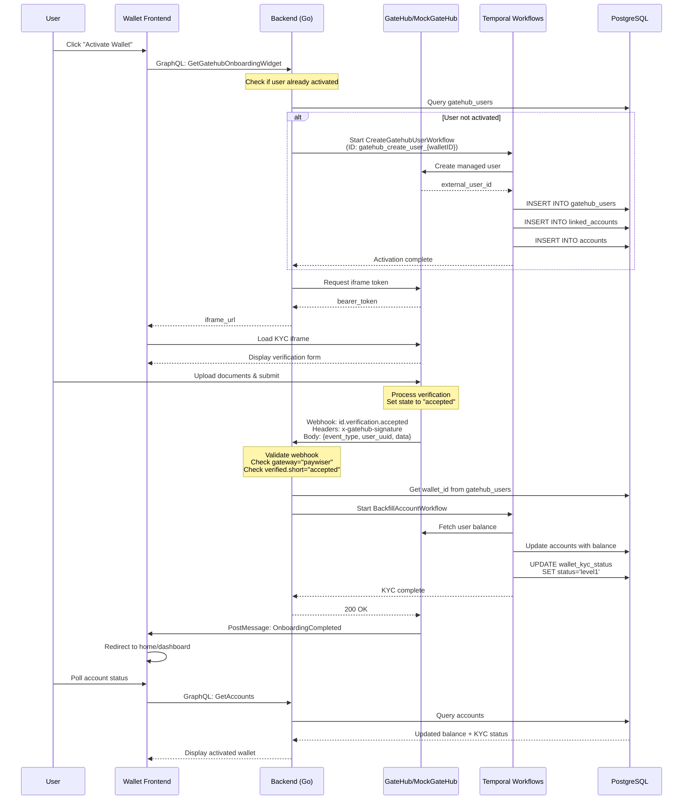
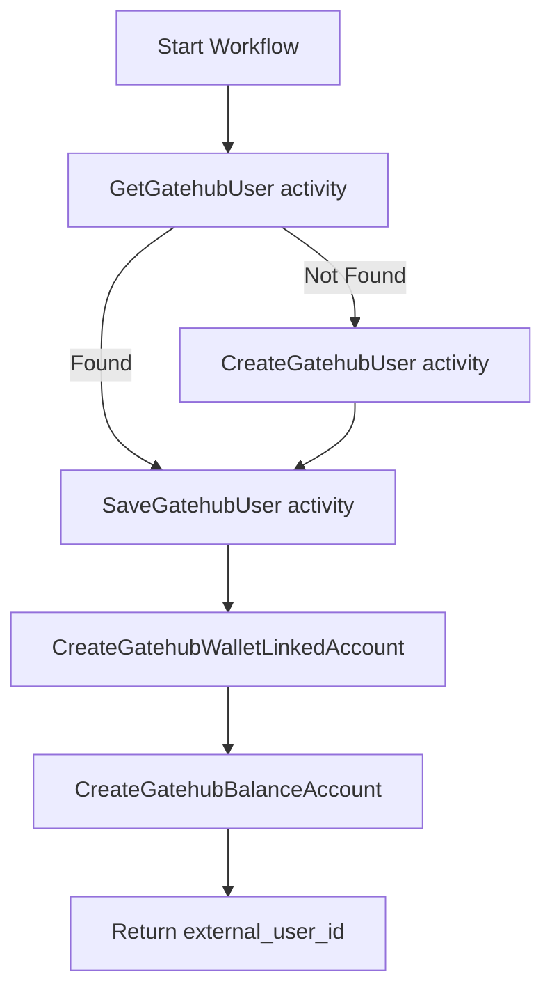
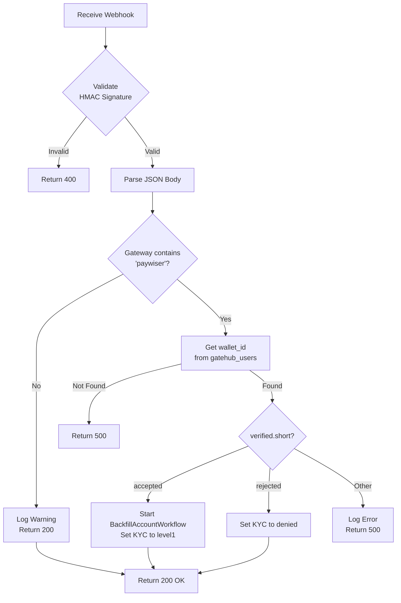
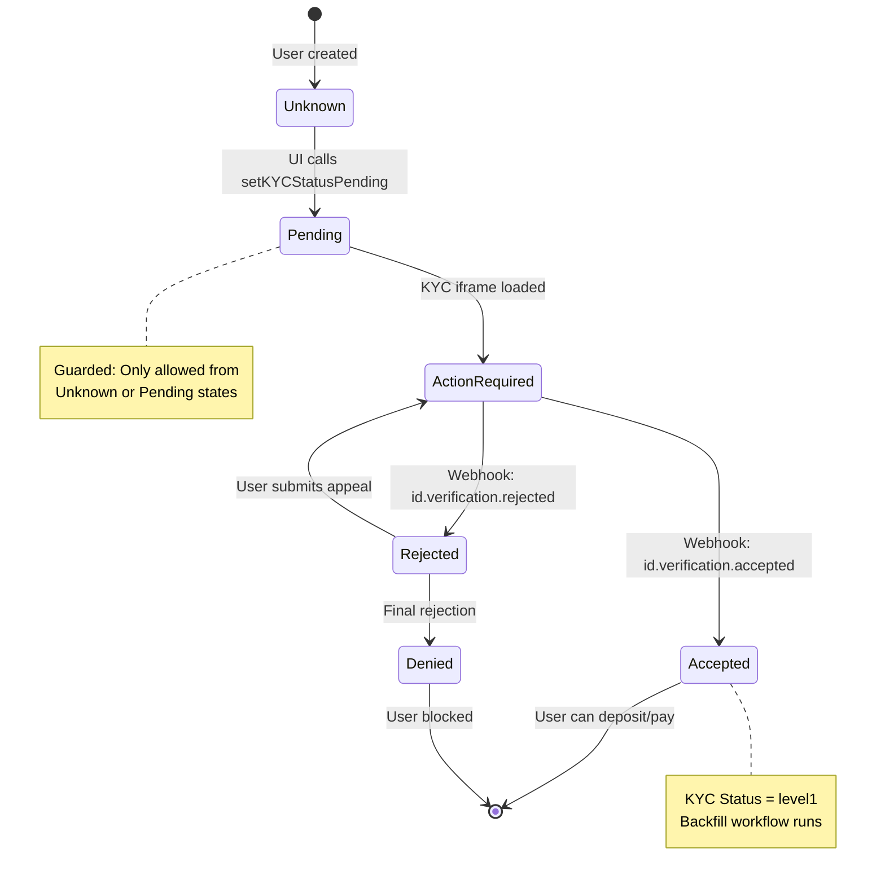

# GateHub KYC & Account Activation Guide (Local Development)

## Overview

This document explains how Know Your Customer (KYC) verification and account activation work within the Interledger Wallet application when using GateHub as the custody provider. KYC is required before users can deposit funds, make payments, or access certain wallet features.

**Key Concepts:**

- **KYC (Know Your Customer)**: Identity verification process required by financial regulations
- **Account Activation**: Process of linking a wallet user to a GateHub managed account
- **Verification States**: `unknown` → `pending` → `action_required` → `accepted` (or `rejected`/`denied`)
- **Gateway**: GateHub uses "Paywiser" as the payment gateway for EU wallets

**Key Components:**
- **Wallet Frontend**: React/Next.js or Remix application with KYC iframe
- **Wallet Backend**: Go API managing workflows and webhooks
- **GateHub/MockGateHub**: External provider handling identity verification
- **Temporal**: Workflow engine orchestrating async operations
- **PostgreSQL**: Storage for user mappings and KYC status

## Account Activation vs KYC Verification

### Account Activation

**Purpose**: Create a GateHub managed user account and link it to the wallet

**Workflow**: `CreateGatehubUserWorkflow` (ID: `gatehub_create_user_{walletID}`)

**Activities**:
1. **GetGatehubUser**: Check if wallet already has a GateHub user mapping
2. **CreateGatehubUser**: Create managed user in GateHub (if not exists)
3. **SaveGatehubUser**: Store mapping in `gatehub_users` table
4. **CreateGatehubWalletLinkedAccount**: Create linked account record
5. **CreateGatehubBalanceAccount**: Initialize balance account

**Database Changes**:
```sql
-- User mapping created
INSERT INTO gatehub_users (wallet_id, external_id) VALUES (...);

-- Linked account created (provider-specific)
INSERT INTO linked_accounts (wallet_id, provider, provider_id, name) VALUES (...);

-- Balance account initialized
INSERT INTO accounts (wallet_id, asset_code, value) VALUES (...);
```

**Provider-Specific Logic**: The `CreateGatehubUser` activity is GateHub-specific. Alternative providers would need:
- Different user creation API calls
- Different account structures (e.g., Stripe customer IDs, Circle wallets)
- Different linked account metadata

### KYC Verification

**Purpose**: Verify user identity through document upload and review

**Workflow**: Started via iframe interaction, completed via webhook

**Flow**:
1. User initiates KYC from wallet UI (personal details page)
2. Backend requests iframe URL from GateHub
3. User completes verification in iframe
4. GateHub sends webhook: `id.verification.accepted` or `id.verification.rejected`
5. Backend triggers `BackfillAccountWorkflow` and sets KYC status

**Database Changes**:
```sql
-- KYC status updated
UPDATE wallet_kyc_status SET status = 'level1', updated_at = NOW() WHERE wallet_id = ...;
```

**Provider-Specific Logic**: The KYC verification process is highly provider-specific:

**GateHub**:
- Uses iframe-based onboarding widget
- Webhook events: `id.verification.accepted`, `id.verification.rejected`, `id.verification.action_required`
- Gateway validation: Must contain "paywiser" for EU wallets
- Verification payload: `data.verified.short` field with `"accepted"` or `"rejected"`

**Alternative providers (e.g., Persona, Veriff)**:
- May use redirect-based flows instead of iframes
- Different webhook event names
- Different verification state mappings
- May require additional document types
- Different risk scoring systems

**Where provider logic is isolated**:
- `backend/providers/gatehub/ops/webhooks.go`: Webhook parsing and routing
- `backend/providers/gatehub/ops/workflows.go`: GateHub-specific workflows
- `backend/providers/gatehub/external/client.go`: API client calls
- `typescript/protea/app/routes/personal-details.tsx`: Frontend iframe handling

## Complete KYC Flow



## Workflow Details

### CreateGatehubUserWorkflow

**Temporal Workflow ID**: `gatehub_create_user_{walletID}`

**Purpose**: Create and link GateHub managed user to wallet

**Activities Execution**:



**Critical Requirements**:
- Must be idempotent (can be retried safely)
- GateHub must return a wallet with `primary: true`
- Linked account uses the GateHub wallet address as `provider_id`

**Common Failure Points**:
- Network timeout calling GateHub API
- Missing primary wallet in GateHub response
- Duplicate external_id constraint violation

### LinkGatehubUserToGatewayWorkflow

**Temporal Workflow ID**: `gatehub_link_user_{externalUserID}`

**Purpose**: Connect managed user to Paywiser gateway

**Activity**:
- `LinkGatehubUserToGateway`: Makes API call to connect user to gateway

**When it runs**:
- Automatically after CreateGatehubUserWorkflow completes
- Required before KYC iframe can be displayed

### BackfillAccountWorkflow

**Triggered by**: `id.verification.accepted` webhook

**Purpose**: Sync GateHub balance to wallet database and set KYC status

**Activities**:
1. **CheckIfBackfillWasDone**: Prevent duplicate backfills
2. **GetLinkedAccount**: Fetch linked account details
3. **BackfillPaywiserBalanceAfterKYC**: Get current balance from GateHub
4. **MarkBackfillUser**: Update account balance
5. **SetKYCStatus**: Update wallet_kyc_status to `level1`

## Webhook Processing

### id.verification.accepted Webhook

**Endpoint**: `POST /webhooks/gatehub`

**Expected Payload**:
```json
{
  "uuid": "webhook-id",
  "timestamp": "1706178166863",
  "event_type": "id.verification.accepted",
  "user_uuid": "gatehub-external-user-id",
  "environment": "sandbox",
  "data": {
    "gateway": "paywiser-eu-sandbox",
    "verified": {
      "short": "accepted",
      "status": 1
    }
  }
}
```

**Processing Logic**:



**Key Validations**:
1. **HMAC Signature**: Webhook must be signed with shared secret
2. **Gateway Check**: Must contain "paywiser" (case-insensitive)
3. **Verification Status**: `data.verified.short` must be `"accepted"` or `"rejected"`

**Provider-Specific Notes**:
- **Gateway field**: GateHub includes gateway name in webhook data. Other providers may not have this concept.
- **Verification structure**: The `verified.short` and `verified.status` fields are GateHub-specific. Alternative providers might use:
  - Persona: `inquiry.status` field
  - Veriff: `verification.status` field
  - Stripe Identity: `verification_session.status` field

### id.verification.rejected Webhook

**Processing**:
- Sets `wallet_kyc_status` to `denied`
- No backfill workflow triggered
- User cannot proceed with deposits/payments

### id.verification.action_required Webhook

**Processing**:
- User needs to provide additional information
- Email notification sent (production only)
- KYC status remains pending or reverts to action_required

## KYC Status State Machine



**Status Definitions**:

| Status | Description | Database Value | Actions Allowed |
|--------|-------------|----------------|-----------------|
| **Unknown** | Default state | `unknown` | Registration only |
| **Pending** | UI initiated KYC | `pending` | Wait for iframe load |
| **Action Required** | GateHub needs documents | `action_required` | Submit documents |
| **Accepted** | Verification passed | `level1` | All features enabled |
| **Rejected** | Verification failed | `rejected` | Limited - can appeal |
| **Denied** | Permanently blocked | `denied` | No actions |

## Frontend Integration

### Personal Details Page (Remix/React)

**File**: `typescript/protea/app/routes/personal-details.tsx`

**Key Elements**:
1. **Iframe Embedding**: Loads GateHub onboarding widget
2. **PostMessage Listener**: Waits for completion message from iframe
3. **Status Update**: Submits form action to backend when complete

**PostMessage Contract**:
```typescript
// Message from GateHub iframe
interface OnboardingCompletedMessage {
  type: 'OnboardingCompleted';
  value: string; // JSON.stringify({ applicantStatus: 'submitted' })
}

interface OnboardingErrorMessage {
  type: 'OnboardingError';
  value: { message: string };
}
```

**Event Handler**:
```typescript
useEffect(() => {
  const onKYCComplete = (e: MessageEvent) => {
    if (!e.data?.type || !e.data?.value) return;
    
    let parsedValue = JSON.parse(e.data.value);
    
    if (
      e.data.type === 'OnboardingCompleted' &&
      parsedValue?.applicantStatus === 'submitted'
    ) {
      // Submit form to trigger backend status check
      submit(null, { action: '/personal-details', method: 'post' });
    }
  };
  
  window.addEventListener('message', onKYCComplete);
  return () => window.removeEventListener('message', onKYCComplete);
}, [submit]);
```

**Provider-Specific Notes**:
- **GateHub**: Uses `OnboardingCompleted` message type
- **Alternative providers** might use:
  - Persona: `persona.verification.complete` event
  - Veriff: `veriff.done` event
  - Custom redirect-based flows (no iframe/postMessage)

## Database Schema

### Key Tables

```sql
-- GateHub user mapping
CREATE TABLE gatehub_users (
  wallet_id UUID PRIMARY KEY REFERENCES wallet_users(id),
  external_id VARCHAR NOT NULL, -- GateHub managed user UUID
  created_at TIMESTAMP DEFAULT NOW()
);

-- Linked custody account
CREATE TABLE linked_accounts (
  id UUID PRIMARY KEY,
  wallet_id UUID REFERENCES wallet_users(id),
  provider VARCHAR NOT NULL, -- 'gatehub'
  provider_id VARCHAR NOT NULL, -- GateHub wallet address
  name VARCHAR, -- 'Paywiser EUR Account'
  created_at TIMESTAMP DEFAULT NOW()
);

-- KYC status tracking
CREATE TABLE wallet_kyc_status (
  wallet_id UUID PRIMARY KEY REFERENCES wallet_users(id),
  status VARCHAR NOT NULL, -- 'unknown', 'pending', 'level1', 'denied'
  updated_at TIMESTAMP DEFAULT NOW()
);

-- Balance accounts
CREATE TABLE accounts (
  id UUID PRIMARY KEY,
  wallet_id UUID REFERENCES wallet_users(id),
  asset_code VARCHAR NOT NULL, -- 'EUR', 'USD'
  value NUMERIC(20, 8) DEFAULT 0,
  created_at TIMESTAMP DEFAULT NOW()
);
```

### Provider-Specific Variations

**GateHub**:
- `external_id`: GateHub managed user UUID
- `provider_id`: GateHub wallet address (e.g., `rXXXX...`)
- Single linked account per currency

**Alternative providers** might store:
- **Stripe**: `provider_id` as Stripe customer ID
- **Circle**: `provider_id` as Circle wallet ID
- **Multiple accounts**: Some providers may have multiple accounts per user

## Troubleshooting

### Diagnostic Commands

#### Check Account Activation Status

```bash
# Get wallet ID
WALLET_ID="..."

# Check if GateHub user exists
docker compose exec -T postgres psql -U postgres -d backend -c \
  "SELECT wallet_id, external_id, created_at 
   FROM gatehub_users 
   WHERE wallet_id = '$WALLET_ID';"

# Check linked account
docker compose exec -T postgres psql -U postgres -d backend -c \
  "SELECT id, provider, provider_id, name 
   FROM linked_accounts 
   WHERE wallet_id = '$WALLET_ID' AND provider = 'gatehub';"

# Check KYC status
docker compose exec -T postgres psql -U postgres -d backend -c \
  "SELECT status, updated_at 
   FROM wallet_kyc_status 
   WHERE wallet_id = '$WALLET_ID';"
```

#### Monitor Temporal Workflows

```bash
# List all workflows
docker compose exec -T temporal temporal workflow list --namespace default

# Describe specific workflow
docker compose exec -T temporal temporal workflow describe \
  --namespace default \
  --workflow-id gatehub_create_user_{WALLET_ID}

# Show workflow history (detailed activity execution)
docker compose exec -T temporal temporal workflow show \
  --namespace default \
  --workflow-id gatehub_create_user_{WALLET_ID}

# Terminate stuck workflow
docker compose exec -T temporal temporal workflow terminate \
  --namespace default \
  --workflow-id gatehub_create_user_{WALLET_ID}
```

#### Monitor Logs

```bash
# Watch backend logs for KYC events
docker compose logs -f backend | grep -i "kyc\|verification\|webhook\|gatehub"

# Watch MockGateHub logs
docker compose logs -f mockgatehub | grep -i "kyc\|verification\|webhook"

# Filter for specific workflow
docker compose logs backend | grep "gatehub_create_user_${WALLET_ID}"
```

### Common Issues & Solutions

#### Issue 1: "Missing primary wallet" Error

**Symptoms**:
```
Error creating linked account: No primary wallet found in GateHub response
```

**Root Cause**: GateHub user was created but response doesn't include a wallet with `primary: true`.

**Solution**:
```bash
# For MockGateHub: Ensure wallet creation includes primary flag
# Check user data in Redis
docker compose exec -T redis redis-cli -n 2 GET 'user:{EXTERNAL_USER_ID}' | jq .

# Verify wallet exists and is marked primary
docker compose exec -T redis redis-cli -n 2 GET 'wallet:{WALLET_ADDRESS}' | jq .primary

# Manually fix if needed
docker compose exec -T redis redis-cli -n 2 SET 'wallet:{WALLET_ADDRESS}' \
  '{"address":"...","user_id":"...","primary":true,...}'
```

#### Issue 2: Webhook Not Reaching Backend

**Symptoms**:
- KYC form submits successfully in iframe
- No webhook logs in backend
- KYC status remains `action_required`

**Debugging**:

1. **Verify webhook URL**:
```bash
docker compose exec mockgatehub env | grep WEBHOOK_URL
# Expected: WEBHOOK_URL=http://backend:3003/webhooks/gatehub
```

2. **Check MockGateHub logs**:
```bash
docker compose logs mockgatehub | grep -i webhook
# Look for: "Sending webhook: id.verification.accepted"
```

3. **Test network connectivity**:
```bash
docker compose exec mockgatehub ping -c 2 backend
docker compose exec mockgatehub curl -v http://backend:3003/health
```

4. **Verify backend webhook endpoint**:
```bash
# Should return 405 Method Not Allowed (GET not supported)
curl -v http://localhost:3003/webhooks/gatehub
```

#### Issue 3: Gateway Mismatch (Webhook Ignored)

**Symptoms**:
```
received user verification webhook for another gateway
```

**Root Cause**: Webhook `data.gateway` field doesn't contain "paywiser".

**Why it matters**: The backend filters webhooks to only process Paywiser gateway events (EU wallets).

**Solution**:
```bash
# Check webhook payload in logs
docker compose logs backend | grep "gateway" | grep "verification"

# For MockGateHub: Ensure webhook includes correct gateway
# Check webhook generation code or configuration
```

**Provider-Specific Note**: This validation is GateHub-specific. Other providers may not have gateway concepts.

#### Issue 4: Race Condition - KYC Status Overwritten

**Symptoms**:
- Webhook sets KYC to `level1`
- Frontend sets it back to `pending`
- User sees "pending" status instead of "activated"

**Root Cause**: The personal-details page action can update KYC status after webhook processing completes.

**Solution**: The backend now guards `SetKYCStatusPending` to only allow transitions from `unknown` or `pending`:

```go
// In backend KYC service
func SetKYCStatusPending(ctx context.Context, walletID string) error {
    // Only allow pending if current status is unknown or already pending
    query := `
        UPDATE wallet_kyc_status 
        SET status = 'pending', updated_at = NOW()
        WHERE wallet_id = $1 
        AND status IN ('unknown', 'pending')
    `
    // ...
}
```

**Verification**:
```bash
# Check current KYC status
docker compose exec -T postgres psql -U postgres -d backend -c \
  "SELECT status FROM wallet_kyc_status WHERE wallet_id = '{WALLET_ID}';"

# If stuck in wrong state, manually fix
docker compose exec -T postgres psql -U postgres -d backend -c \
  "UPDATE wallet_kyc_status SET status = 'level1', updated_at = NOW() 
   WHERE wallet_id = '{WALLET_ID}';"
```

#### Issue 5: Stale GateHub User Mapping

**Symptoms**:
- Activation workflow fails
- `gatehub_users` table has entry but external_id is incorrect
- Linked account creation fails

**Solution**:
```bash
# Delete stale mapping
docker compose exec -T postgres psql -U postgres -d backend -c \
  "DELETE FROM gatehub_users WHERE wallet_id = '{WALLET_ID}';"

# Delete linked accounts
docker compose exec -T postgres psql -U postgres -d backend -c \
  "DELETE FROM linked_accounts WHERE wallet_id = '{WALLET_ID}' AND provider = 'gatehub';"

# Terminate any running workflow
docker compose exec -T temporal temporal workflow terminate \
  --namespace default \
  --workflow-id gatehub_create_user_{WALLET_ID}

# Retry activation from UI
```

#### Issue 6: Non-EU Wallet Trying GateHub Activation

**Symptoms**:
- Activation button appears for non-EU user
- Backend rejects activation request
- Error: "GateHub only supports EU wallets"

**Root Cause**: Frontend didn't check wallet region before showing GateHub option.

**Solution**:
```bash
# Check user's wallet region
docker compose exec -T postgres psql -U postgres -d backend -c \
  "SELECT id, email, region FROM wallet_users WHERE id = '{WALLET_ID}';"

# If not EU, user should use different KYC provider (e.g., Persona, PTI)
```

**Provider-Specific Note**: This restriction is specific to GateHub/Paywiser. Other providers may support different regions.

### Log Analysis Patterns

#### Successful Activation + KYC Flow

```
# Step 1: Workflow started
{"level":"info","msg":"Creating gatehub wallet.","workflow":"CreateGatehubUserWorkflow"}

# Step 2: User created in GateHub
{"level":"info","msg":"ExecuteActivity","ActivityType":"CreateGatehubUser"}

# Step 3: Mapping saved
{"level":"info","msg":"ExecuteActivity","ActivityType":"SaveGatehubUser"}

# Step 4: Linked account created
{"level":"info","msg":"ExecuteActivity","ActivityType":"CreateGatehubWalletLinkedAccount"}

# Step 5: KYC initiated (later)
{"level":"info","msg":"Gatehub webhook","event_type":"id.verification.accepted"}

# Step 6: Gateway validated
{"level":"info","msg":"Calling HandleUserVerificationWebhook"}

# Step 7: Backfill triggered
{"level":"info","msg":"Starting BackfillAccountWorkflow"}

# Step 8: KYC status updated
{"level":"info","msg":"Set KYC status","wallet_id":"...","status":"level1"}
```

#### Failed Activation (Missing Primary Wallet)

```
{"level":"error","Error":"No primary wallet found in GateHub response"}
{"level":"error","msg":"Activity failed","ActivityType":"CreateGatehubWalletLinkedAccount"}
{"level":"error","msg":"Workflow failed","WorkflowType":"CreateGatehubUserWorkflow"}
```

#### Rejected KYC

```
{"level":"info","msg":"Gatehub webhook","event_type":"id.verification.rejected"}
{"level":"info","msg":"Setting KYC status to denied","wallet_id":"..."}
```

### Quick Diagnostic Checklist

- [ ] Wallet region is EU (for GateHub)
- [ ] `gatehub_users` table has mapping for wallet_id
- [ ] `linked_accounts` table has entry with provider='gatehub'
- [ ] `wallet_kyc_status` shows current status
- [ ] CreateGatehubUserWorkflow completed successfully
- [ ] LinkGatehubUserToGatewayWorkflow completed
- [ ] Webhook URL configured correctly in MockGateHub
- [ ] Backend can reach MockGateHub (network connectivity)
- [ ] Webhook payload includes gateway="paywiser"
- [ ] Webhook verified.short field is "accepted"

### Environment Differences

#### Local Development (MockGateHub)

- **Auto-approval**: KYC approved immediately on form submission
- **No real documents**: Form submission doesn't validate uploads
- **Webhook delivery**: Async with 3 retries
- **Storage**: Redis (volatile unless persistence enabled)

#### Sandbox/Production (Real GateHub)

- **Manual review**: KYC reviewed by GateHub compliance team
- **Real documents**: Passport/ID required
- **Webhook delivery**: Real HTTPS endpoint required
- **Storage**: GateHub's persistent database
- **Gateway**: Must be configured per environment

## Related Documentation

- [GateHub Deposits Guide](gatehub-deposits-troubleshooting.md)
- [Email Verification Troubleshooting](email-verification-troubleshooting.md)
- [Temporal Workflow Documentation](https://docs.temporal.io/)
- [MockGateHub README](https://github.com/interledger/mockgatehub/blob/main/README.md)
- [GateHub API Documentation](https://developers.gatehub.net/) (external)
