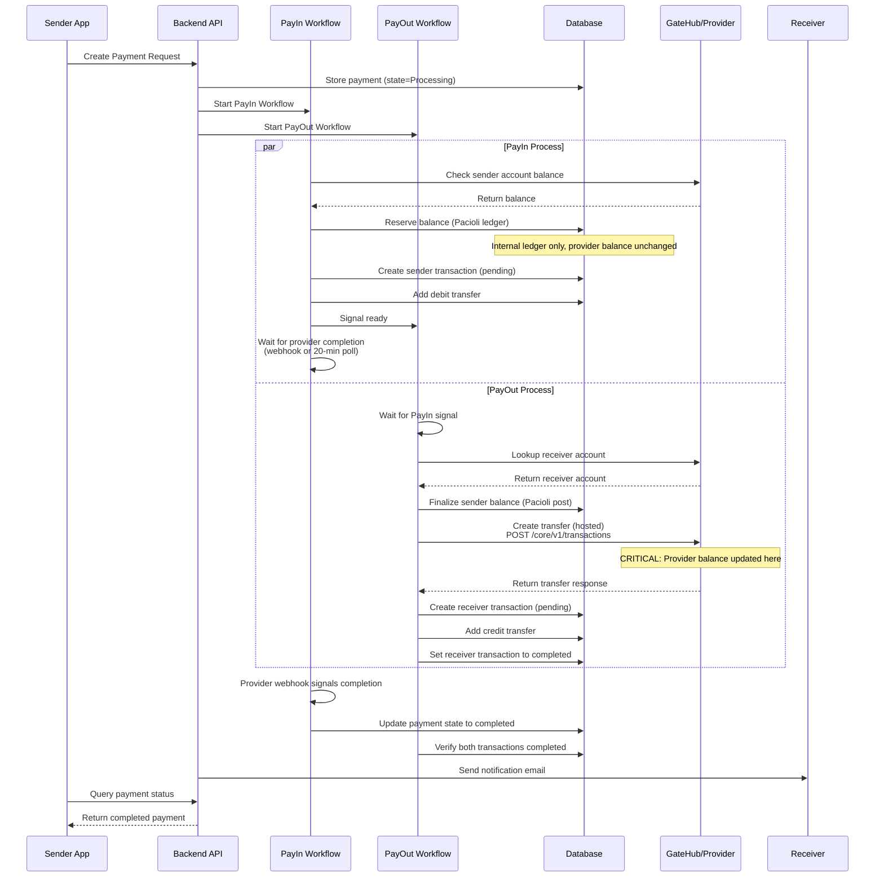
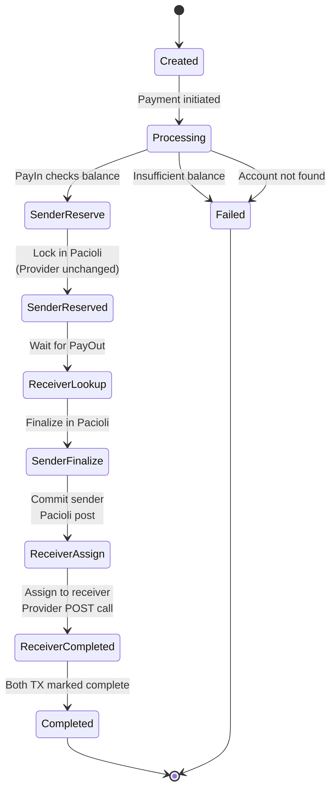
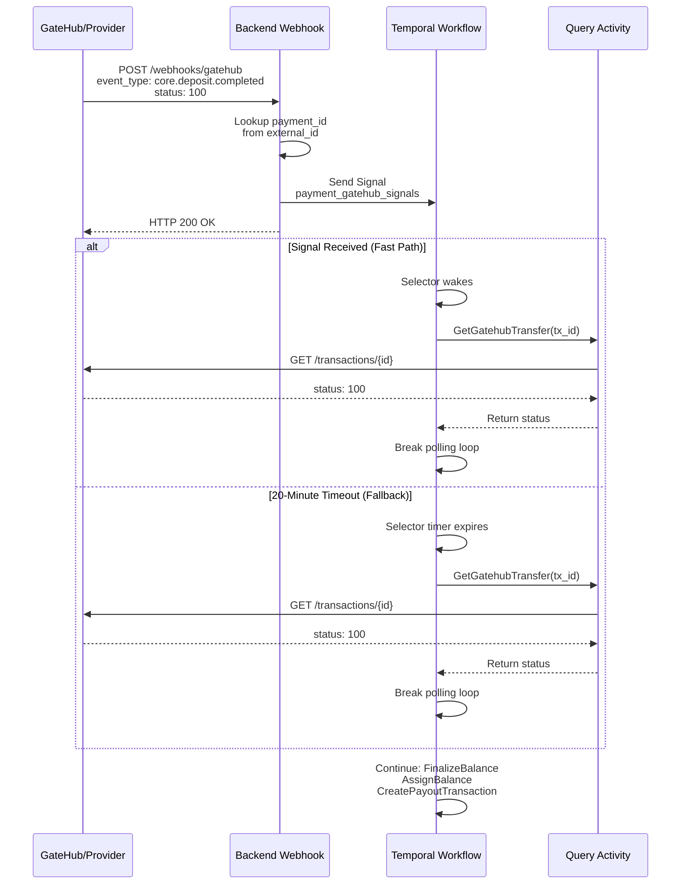

# GateHub Payments Workflow

## Overview

This document describes how the Interledger App Wallet processes payments using GateHub as the provider. It covers the complete payment journey from creation through settlement, including account management, balance operations, and webhook-based completion detection. Where applicable, we note how logic differs for alternative providers (Xago, PTI).

## Payment Types and Provider Routing

The wallet supports multiple payment types, each with different provider-specific implementations:

| Payment Type | Provider | Balance Flow | Transaction Creation | Notes |
|---|---|---|---|---|
| **Peer2Peer (P2P)** | GateHub/Xago/PTI | Reserve → Finalize → Assign | Local workflow | Direct transfer between wallet users |
| **Withdrawal** | GateHub/Xago/PTI | Reserve → Finalize (no assign) | Local workflow | Wallet to external bank account |
| **Deposit** | GateHub/Xago/PTI | (no reserve) → Assign | Local workflow | External bank account to wallet |
| **RafikiPeer2Peer** | Rafiki webhook | Reserve → Finalize → Assign | Rafiki webhook | P2P via open payments network |
| **WebMonetization** | Rafiki webhook | Reserved via Rafiki | Rafiki webhook | Incoming payments via web monetization |
| **Rafiki2External** | Rafiki webhook | Reserve → Finalize (no assign) | Rafiki webhook | Rafiki to external account |

**Provider Divergence Note**: Xago and PTI follow the same workflow pattern as GateHub for P2P/Withdrawal/Deposit types. Rafiki payments differ fundamentally—receive transactions are created asynchronously by webhook handlers, not by the payment workflow.

## Peer-to-Peer Payment Workflow

### Sequence Diagram



### Balance State Transitions



### Provider-Specific Behavior

**GateHub/Xago/PTI (Balance Accounts)**:
- Reserve: Internal Pacioli ledger update, provider balance unchanged
- Finalize: Pacioli post transfer committed
- Assign: API call to provider creates hosted transfer (status=1)
- Webhook/Poll: Monitor transaction until status=100

**Provider Divergence for Different Account Types**:
- **Bank Accounts** (Withdrawal): No receiver assign step; transaction remains pending until bank processes
- **Card Accounts**: Provider-specific rate limiting and transaction limits apply
- **Rafiki (External Wallets)**: Receive transaction created by webhook handler, not by workflow

### Critical Implementation Notes

1. **Reserve does NOT call provider API**: The balance reservation is internal (Pacioli ledger only). Provider balance unchanged.
2. **Assign DOES call provider API**: The hosted transfer (POST /core/v1/transactions) is where provider balance updates.
3. **Completion Detection**: Uses hybrid approach—webhook signals with 20-minute polling fallback.
4. **Status Code Matching**: Provider must return `status=100` for completion, not `1`, `2`, or other values.

## Transaction Completion Detection

The wallet uses a hybrid webhook + polling mechanism to reliably detect when provider transactions complete.



### Transaction Status Codes

Provider APIs return standard status codes to indicate transaction state:

| Code | Meaning | Workflow Action |
|------|---------|-----------------|
| `1` | Pending - processing | Continue polling |
| `100` | Completed - success | Break loop, continue workflow |
| `3` | Failed - error | Mark payment failed |

**Critical**: The workflow exits the polling loop **only** when `status == 100`. Returning non-standard codes (e.g., `2`) causes indefinite polling.

### Provider Divergence

- **GateHub/MockGatehub**: Uses webhook + polling with `status=100` for completion
- **Xago/PTI**: Same mechanism, but different endpoint implementations
- **Rafiki**: No webhook-triggered polling; receive transaction created asynchronously when Rafiki notifies of incoming payment completion

## Database Reference

### Key Tables

| Table | Purpose | Key Fields |
|-------|---------|-----------|
| `payments` | Payment records | id, public_id, state, sender_id, receiver_id, sender_account, receiver_account, send_transaction_id, receive_transaction_id |
| `transactions` | Individual transactions (send/receive) | id, wallet_id, foreign_id, state, provider, type, amount |
| `transfers` | Transaction line items (debit/credit) | id, transaction_id, linked_acc_id, type, state, amount |
| `linked_accounts` | Provider account mappings | id, wallet_id, provider, type, provider_id, send_currency, receive_currency |
| `gatehub_users` | GateHub account mappings | id, external_id, wallet_id, external_customer_id, external_account_id |
| `gatehub_transactions` | GateHub external transaction tracking | payment_id, external_id, status |

### Essential Queries

**Check Payment Status:**
```sql
SELECT id, public_id, state, sender_id, receiver_id, send_transaction_id, receive_transaction_id
FROM payments WHERE public_id = '12345-67890';
-- States: 1=Created, 2=Processing, 3=Completed, 4=Failed
```

**Verify Receive Transaction Exists:**
```sql
SELECT t.id, t.state FROM transactions t
WHERE t.id = (SELECT receive_transaction_id FROM payments WHERE id = 'payment-uuid');
-- Critical: Should show 'completed' state, not NULL or 'pending'
```

**Check Linked Accounts for User:**
```sql
SELECT provider, type, send_currency, receive_currency
FROM linked_accounts WHERE wallet_id = 'wallet-uuid';
```

**Trace Complete Payment Flow:**
```sql
WITH p AS (SELECT id, send_transaction_id, receive_transaction_id FROM payments WHERE id = 'payment-uuid')
SELECT 'SENDER' as role, t.state, tf.type, tf.amount
FROM p LEFT JOIN transactions t ON t.id = p.send_transaction_id
LEFT JOIN transfers tf ON tf.transaction_id = t.id
UNION ALL
SELECT 'RECEIVER' as role, t.state, tf.type, tf.amount  
FROM p LEFT JOIN transactions t ON t.id = p.receive_transaction_id
LEFT JOIN transfers tf ON tf.transaction_id = t.id;
```

## Troubleshooting

### Common Scenarios

#### 1. Receiver Doesn't See Money

**Symptoms:**
- Sender transaction shows completed
- Receiver has no transaction
- `receive_transaction_id` is NULL in payments table

**Root Causes & Fixes:**
- **Receiver account missing**: Ensure receiver completed KYC and has linked account for payment currency
  ```sql
  SELECT * FROM linked_accounts 
  WHERE wallet_id = 'receiver-id' AND receive_currency = 'USD';
  ```
- **External receiver URL**: For Rafiki payments to external wallets (URLs starting with `https://`), receive transactions are created by Rafiki webhook, not the workflow. Verify webhook was received.
- **Transaction creation failed**: Check `UpdatePayoutTransactionState()` was called
  ```sql
  SELECT state FROM transactions WHERE id = 'receive-tx-uuid';
  -- Should be 'completed', not 'pending'
  ```

#### 2. Workflow Stuck in Polling Loop

**Symptoms:**
- PayOut workflow RUNNING in Temporal UI
- Workflow waiting on 20-minute timer
- Webhook received but workflow doesn't exit

**Root Cause & Fix:**
- **Status code not 100**: Provider returning non-standard status code. The workflow only exits when `status == 100`.
  ```bash
  # Check actual status in provider
  docker exec local-redis-1 redis-cli -n 2 GET "tx:<external_id>" | jq '.status'
  # Expected: 100 (not 1, 2, or other values)
  ```
- **Signal never sent**: Webhook received but signal not delivered to workflow
  ```bash
  docker compose logs backend | grep -E "(SignalGatehubTransferComplete|payment_pay_out_)"
  # Verify signal was sent with correct workflow_id format
  ```
- **Webhook misconfiguration**: Provider not sending webhook or backend not receiving it
  ```bash
  docker compose logs mockgatehub | grep -i webhook
  docker compose logs backend | grep "Webhook received"
  ```

#### 3. Payment Processing Fails Immediately

**Symptoms:**
- Payment state changes to Failed (4)
- Error in logs about missing account

**Root Cause & Fix:**
- **Sender account missing**: Sender hasn't linked provider account
  ```sql
  SELECT * FROM linked_accounts
  WHERE wallet_id = 'sender-id' AND send_currency = 'USD';
  ```
- **Insufficient balance**: Sender doesn't have enough balance
  ```bash
  curl http://localhost:8080/wallets/{sender_id}/balance
  ```
- **Receiver not identified**: Email/external identifier lookup failed

#### 4. Balance Updated in Provider But Not in Database

**Symptoms:**
- Provider (MockGatehub) shows new balance
- Database transaction shows pending
- Receiver's app doesn't reflect update

**Root Cause & Fix:**
- **Transaction state not updated**: `CreatePayoutTransaction()` or `UpdatePayoutTransactionState()` failed
  ```sql
  SELECT state FROM transactions WHERE id = 'receive-tx-uuid';
  ```
- **Pacioli post transfer not committed**: Finalize step failed
  ```bash
  docker compose logs backend | grep -E "(FinaliseReserve|Pacioli.*post)"
  ```

### Debug Commands

**View Payment Status:**
```bash
# Check database
psql wallet_backend -c "
  SELECT id, public_id, state, send_transaction_id, receive_transaction_id
  FROM payments WHERE id = 'payment-uuid';"

# Check provider
curl http://localhost:8080/core/v1/transactions/<tx_uuid>

# Check Temporal workflow
docker exec local-temporal-1 temporal workflow describe \
  --workflow-id "payment_pay_out_<payment_id>" \
  --namespace default
```

**Trace Webhook Delivery:**
```bash
# Full webhook path
docker compose logs mockgatehub | grep "core.deposit.completed"     # Provider sent
docker compose logs backend | grep "Webhook received"               # Backend received
docker compose logs backend | grep "SignalGatehubTransferComplete"  # Signal sent
docker compose logs backend | grep "SIGNAL RECEIVED"                # Workflow received
```

**Check Transaction Status in Provider:**
```bash
# Via Redis (if using Redis storage)
docker exec local-redis-1 redis-cli -n 2 GET "tx:<external_id>" | jq '.status'

# Via API
curl http://localhost:8080/core/v1/transactions/<tx_id>
```

**Validate Account Setup:**
```bash
# Sender account
curl http://localhost:8080/id/v1/users/<sender_id>

# Receiver account
curl http://localhost:8080/id/v1/users/<receiver_id>

# Sender balance
curl http://localhost:8080/wallets/<sender_id>/balance

# Receiver balance  
curl http://localhost:8080/wallets/<receiver_id>/balance
```

### Prevention Checklist

Before investigating payment issues, verify:

- [ ] Both users completed KYC (status=accepted in provider)
- [ ] Both users have linked accounts for the payment currency
- [ ] Sender has sufficient balance
- [ ] Webhook URL configured correctly in provider
- [ ] Temporal instance running (check Temporal UI)
- [ ] PostgreSQL/Redis accessible
- [ ] Provider API accessible (curl health endpoint)
- [ ] Payment state is Processing or Completed, not Failed

---

*Last updated: January 28, 2026*
*Reworked with mermaid diagrams, provider divergence notes, and consolidated troubleshooting*
