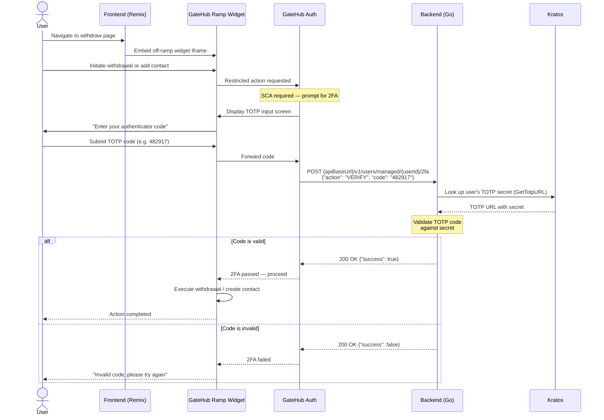
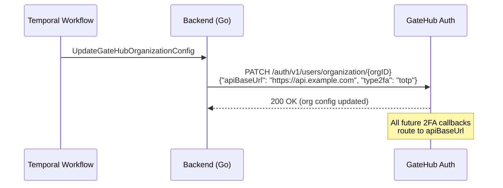

# GateHub SCA — TOTP Verification Flow

## Regulatory Context

Strong Customer Authentication (SCA) must be implemented by **March 4, 2026**. After that date, withdrawals and SEPA contact creation will no longer be possible without 2FA verification in place.

## Overview

GateHub enforces 2FA on "restricted actions" — currently SEPA Contact Creation and SEPA Payment (withdrawal). When a user performs one of these actions inside GateHub's Ramp widget, GateHub pauses the action and prompts the user to enter a TOTP code. GateHub then calls the integrator's backend to verify the code. Only on a successful response does the action proceed.

Our implementation reuses the TOTP secret that users already configured during Kratos onboarding (the same authenticator app entry they use to log in). No additional TOTP enrollment is needed — the user simply enters their current authenticator code when GateHub asks for it.

## Actors

| Actor | Role |
|-------|------|
| **User** | Interacts with the wallet UI and the GateHub Ramp widget embedded within it |
| **Frontend** | Remix app serving the wallet UI and embedding GateHub's Ramp widget iframe |
| **GateHub Ramp Widget** | GateHub-hosted iframe that handles deposit/withdrawal/contact flows |
| **GateHub Auth** | GateHub's authentication service that orchestrates 2FA verification |
| **Backend** | Interledger-app Go backend (`go/backend`) |
| **Kratos** | Ory Kratos identity server holding user credentials including TOTP secrets |

## Prerequisites

Before any 2FA flow can work, the integrator must configure the organization:

1. The backend calls `PATCH /auth/v1/users/organization/{orgID}` on GateHub Auth with:
   - `apiBaseUrl` — the HTTPS URL where GateHub can reach the backend (e.g. `https://api.example.com`)
   - `type2fa` — `"totp"` (we use TOTP, not SMS)

2. GateHub stores this configuration and uses it to route all 2FA callbacks to the backend.

This is a one-time setup step, executed via the `UpdateGateHubOrganizationConfig` Temporal workflow.

## Withdrawal / Contact Creation Flow

### Sequence Diagram



### Step-by-Step

1. **User navigates to the withdrawal page.** The frontend renders GateHub's off-ramp widget inside an iframe.

2. **User initiates a restricted action** (withdraw funds or add a new SEPA contact) inside the Ramp widget.

3. **GateHub detects the action is restricted** and requires SCA. The widget shows a TOTP input screen asking the user to enter their authenticator code.

4. **User opens their authenticator app** (the same one they enrolled during Kratos TOTP setup) and enters the current 6-digit code.

5. **GateHub Auth calls the backend** at `POST {apiBaseUrl}/v1/users/managed/{userId}/2fa` with:
   ```json
   {
     "action": "VERIFY",
     "code": "482917"
   }
   ```

6. **The backend validates the code:**
   - Looks up the user's TOTP secret from Kratos using `GetTotpURL()` (extracts the TOTP URL from the user's Kratos identity credentials)
   - Validates the submitted code against the TOTP secret using standard TOTP verification (time-based, typically ±1 window tolerance)

7. **The backend responds:**
   - `{"success": true}` — code is valid, GateHub proceeds with the action
   - `{"success": false}` — code is invalid, GateHub shows an error and the user can retry

## TOTP Reuse — Why No New Enrollment

Users already set up TOTP during Kratos onboarding. The authenticator app entry (Google Authenticator, Authy, etc.) generates codes based on a shared secret. That same secret is stored in Kratos and can be retrieved by the backend via `GetTotpURL()`.

When GateHub asks "enter your authenticator code", the user enters the exact same rotating code they would use to log in. There is no separate TOTP enrollment for GateHub — a single authenticator app entry covers both login and SCA.

The code submitted is not the original secret — it is a fresh time-based code derived from that secret, valid for a ~30-second window.

## 2FA Callback Endpoint Contract

### Request (GateHub → Backend)

```http
POST {apiBaseUrl}/v1/users/managed/{userId}/2fa HTTP/1.1
Content-Type: application/json

{
  "action": "VERIFY",
  "code": "482917"
}
```

The `action` field can be:
- `"VERIFY"` — validate the TOTP code (used for both TOTP and SMS workflows)
- `"INITIATE"` — trigger sending an SMS code (SMS workflow only, not applicable for TOTP)

For our TOTP setup, only `VERIFY` is meaningful. If `INITIATE` is received, the backend can return success immediately since TOTP doesn't require a send step.

### Response (Backend → GateHub)

```http
HTTP/1.1 200 OK
Content-Type: application/json

{
  "success": true
}
```

The HTTP status is always `200`. The `success` boolean in the body determines whether verification passed or failed.

## Organization Configuration Setup

Before the 2FA callback works, the organization must be configured. This is a one-time setup:



In the Interledger-app stack:
- `GATEHUB_ORGANIZATION_ID` identifies which organization to configure
- `GATEHUB_API_BASE_URL` is the URL GateHub will call back to (must be reachable from GateHub)
- The Temporal workflow `UpdateGateHubOrganizationConfig` sends the PATCH request

## Webhooks vs 2FA Callbacks — Two Separate Channels

GateHub communicates with the integrator's backend through two distinct mechanisms that serve fundamentally different purposes:

### Regular Webhooks (Async, One-Way)

| Aspect | Detail |
|--------|--------|
| **URL** | Configured via a dedicated webhook URL (e.g. `http://backend:8080/webhooks/gatehub`) |
| **Direction** | GateHub → Backend (fire-and-forget) |
| **Nature** | Asynchronous notification — GateHub does not wait for a meaningful response |
| **Expected response** | Any `2xx` status code; body is ignored |
| **Routing** | All event types arrive at the same endpoint; the backend dispatches based on the `event_type` field in the JSON payload |
| **Examples** | `core.deposit.completed`, `id.verification.accepted`, `cards.card.created` |

All webhooks share a single URL and are differentiated purely by `event_type`:

```json
{
  "uuid": "...",
  "event_type": "core.deposit.completed",
  "user_uuid": "...",
  "data": { ... }
}
```

The backend handler switches on `event_type` to route to the appropriate processing logic (deposit handler, KYC handler, card handler, etc.).

### 2FA Callbacks (Synchronous, Two-Way)

| Aspect | Detail |
|--------|--------|
| **URL** | Derived from `apiBaseUrl` in the organization config (e.g. `https://api.example.com/v1/users/managed/{userId}/2fa`) |
| **Direction** | GateHub → Backend (request/response) |
| **Nature** | Synchronous — GateHub **blocks and waits** for the answer before proceeding |
| **Expected response** | `200 OK` with `{"success": true}` or `{"success": false}` — the body directly determines whether the user's action is allowed |
| **Routing** | Specific REST-style path per operation (`/v1/users/managed/{userId}/2fa`) |
| **Examples** | `VERIFY` (validate TOTP/SMS code), `INITIATE` (trigger SMS send) |

The 2FA callback is not a notification — it is a real-time question: _"Should I let this user proceed? Yes or no?"_ GateHub waits for the answer before continuing or rejecting the user's withdrawal/contact action.

### Why Two Mechanisms?

We believe GateHub uses a separate `apiBaseUrl` rather than routing 2FA through the existing webhook URL because the two serve architecturally different roles:

1. **Webhooks are asynchronous and loosely coupled.** GateHub fires a notification and moves on. If the backend is slow or temporarily down, GateHub retries later. The backend's response content doesn't affect GateHub's behavior — a `200` just means "received".

2. **2FA callbacks are synchronous and tightly coupled.** The user is waiting in the widget while GateHub calls the backend. The response body (`success: true/false`) directly controls the user experience — proceed or show an error. There is no retry; the round-trip must complete in real time.

3. **Different URL construction patterns.** Webhooks go to a fixed URL for all events. 2FA callbacks construct a RESTful path that includes the user ID (`/v1/users/managed/{userId}/2fa`), making the endpoint user-specific rather than event-type-specific.

4. **Separate configuration lifecycle.** The webhook URL is typically set up during initial integration onboarding. The `apiBaseUrl` is configured per-organization via `PATCH /auth/v1/users/organization/{orgID}` and can be updated at runtime — for example, when migrating to a new backend deployment.

In our stack, this translates to two environment variables that should not be confused:

| Variable | Set on | Points to | Purpose |
|----------|--------|-----------|---------|
| `WEBHOOK_URL` | MockGateHub | `http://backend:8080/webhooks/gatehub` | Async event notifications |
| `GATEHUB_API_BASE_URL` | Backend | `http://mockgatehub:8080` | Where the backend reaches GateHub's API |
| `apiBaseUrl` (org config) | GateHub (stored) | `https://api.example.com` | Where GateHub reaches the backend for 2FA |

---

**Created**: February 28, 2026
