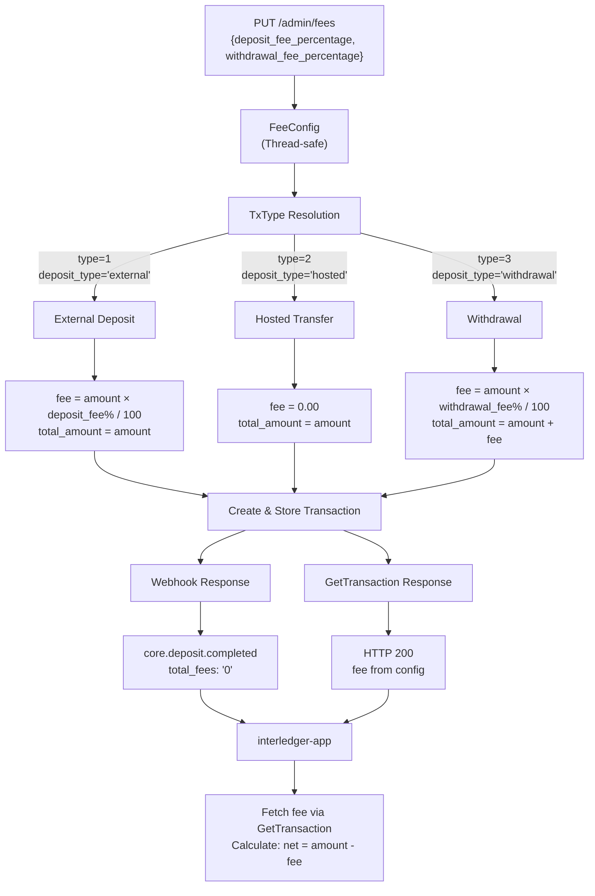

# GateHub Transaction Fees

## Overview

This document explains how transaction fees flow between GateHub, MockGateHub, and the Interledger Wallet application. It serves as a reference for introducing configurable fee support to MockGateHub.

**Key Takeaway**: GateHub charges fees on deposits and withdrawals. The interledger-app backend correctly processes these fees (subtracting them from deposits, adding them to withdrawals). However, the **frontend currently hardcodes fee display as "0.00"** and tells users _"For a limited time, the Interledger Wallet will absorb all fees"_. In practice, MockGateHub also returns `fee: "0.00"`, so no fees are ever deducted in local development.

### Fee Flow Architecture



## Fee Data Model

### GateHub API Transaction Response

GateHub returns fees as **string** values in its transaction API (`GET /core/v1/transactions/{id}`):

```json
{
  "uuid": "tx-id",
  "amount": "100.00",
  "total_amount": "101.50",
  "fee": "1.50",
  "status": 100,
  "type": 1,
  "vault": { "uuid": "vault-id" },
  "sending_wallet": { ... },
  "receiving_wallet": { ... }
}
```

All monetary fields (`amount`, `total_amount`, `fee`) are **strings with two decimal places** — never numbers.

### Interledger-App Internal Representation

The app converts GateHub's string fee to a scaled integer using `StringToScaledUInt`:

```
"1.50" → 150  (uint64, scale 2)
"0.00" → 0
"23,35" → 2335  (handles comma-separated thousands)
```

Source: `go/backend/providers/gatehub/ops/utils.go`

The fee is stored in the `transactions` table as `provider_fee` (bigint, default 0):

```sql
column "provider_fee" {
    null = false
    type = bigint
    default = 0
}
```

## Fee Flow by Transaction Type

### Deposits

```
User deposits €100 → GateHub charges €1.50 fee → User receives €98.50
```

**Step-by-step flow:**

1. **Webhook arrives** (`core.deposit.completed`) with `amount: "100.00"` and `tx_uuid`
   - The webhook payload does **not** contain fee information
2. **App fetches transaction** via `GET /core/v1/transactions/{tx_uuid}`
   - This is the `GetFeeFromGatehubTrasaction` Temporal activity
   - It reads the `fee` field from the response (e.g., `"1.50"`)
3. **App calculates net amount**: `credited = amount - fee` → `100.00 - 1.50 = 98.50`
4. **App creates transaction record** with full amount and fee stored separately:
   - `Amount = 10000` (€100.00 scaled)
   - `ProviderFee = 150` (€1.50 scaled)
5. **App credits user balance** with net amount only (€98.50)

**Critical**: The fee is **not** read from the webhook. It is fetched separately by calling `GetTransaction` on GateHub. This means MockGateHub's `GET /core/v1/transactions/{id}` response is the authoritative source of fee data.

Source: `go/backend/providers/gatehub/ops/workflows.go` (`CreateGatehubDeposit`)

### Withdrawals

```
User withdraws €50 → GateHub charges €1.00 fee → €51.00 debited from balance
```

**Step-by-step flow:**

1. **App creates withdrawal** on GateHub via the transaction API
2. **App fetches transaction** to get the fee via `GetTransaction`
3. **App reserves balance**: `amount + fee` is reserved from user balance
4. **Transaction record** stores both amount and fee

Source: `go/backend/providers/gatehub/ops/ops.go` (`validateWithdrawal`, `CreateWithdrawal`)

### Inter-Wallet Payments (P2P)

**No GateHub fees.** The fee is hardcoded to zero:

```go
fee := currency.FromFloat64(0, currency.USD)  // hardcoded to zero
```

The gRPC response also hardcodes fees to zero:

```go
fees := currency.FromUInt64(0, p.SenderAmount.Currency)
ret := &pb.Payment{
    FormattedFees: fees.Format(),  // always "0.00"
}
```

Source: `go/backend/payments/ops/ops.go`, `go/backend/grpc/payments.go`

### Card Transactions

Card transactions use `BillingAmount` directly with **no separate fee field**. Any currency conversion markup is embedded in the difference between `TransactionAmount` (merchant currency) and `BillingAmount` (cardholder currency).

Source: `go/backend/providers/gatehub/ops/activity.go` (`CreateGatehubCardTransaction`)

### Cross-Currency (FX)

The database schema has columns for `fx_fee_percentage` and `protection_fee_percentage`, but **cross-currency payments currently return an error** — these fields are never used:

```go
return args, 0, 0, fmt.Errorf("%w cross currency not supported", payments.ErrInternal)
```

Source: `go/backend/payments/ops/ops.go` (`applyFXCreate`)

## Fee Absorption: What It Means

The frontend displays this message on deposit, withdrawal, and payment screens:

> _"For a limited time, the Interledger Wallet will absorb all fees."_

Along with a hardcoded fee display of `0.00`:

```tsx
<span className='text-weak'>Fees</span>
<span className='text-medium'>0.00</span>
```

Source: `typescript/protea/app/routes/deposit/fynbos.tsx`, `withdraw.tsx`, `pay_.$paymentId/Amount.tsx`

**What "absorb" means in practice today:**

| Layer | What happens |
|-------|-------------|
| **GateHub sandbox** | Returns `fee: "0.00"` (sandbox doesn't charge fees) |
| **MockGateHub** | Returns `fee: "0.00"` (hardcoded) |
| **Backend** | Correctly processes fee: `net = amount - fee`. Since fee is 0, user gets full amount |
| **Frontend** | Hardcodes `"0.00"` display, regardless of what the backend reports |

The backend code **does** properly handle non-zero fees — it would deduct them from deposits and add them to withdrawals. The "absorption" is currently cosmetic: in local/sandbox environments fees are zero anyway, and in production the UI simply hides the real fee from the user at the initiation step, though the transaction detail would show the actual fee via `payment.formattedFees` and `transaction.fees`.

**When GateHub starts charging real fees in production**, the backend would correctly deduct them from user balances. Whether the Interledger Foundation is truly "absorbing" those fees (reimbursing users) or simply not showing them is a product/business decision — the code currently does the latter (hides, doesn't reimburse).

## How Transaction Details Display Fees

On **transaction detail** screens, the real fee is shown:

```go
// go/backend/grpc/transactions.go — transformTransaction()
if tx.ProviderFee != nil {
    fees = tx.ProviderFee.Format()  // real fee from GateHub
}

// For deposits: FundsReceived = Amount - ProviderFee
// For withdrawals: FundsReceived = Amount + ProviderFee
```

So once a transaction is completed, the user can see the actual GateHub fee on the transaction detail page, even though the initiation screen showed `0.00`.

## MockGatehub Implementation

### Runtime-Configurable Fees

MockGatehub now supports **runtime-configurable transaction fees** via the `/admin/fees` endpoint. This allows e2e tests to simulate non-zero fees without restarting the service.

```go
// internal/handler/fees.go — FeeConfig
type FeeConfig struct {
    mu                   sync.RWMutex
    depositFeePercent    float64   // 0-100
    withdrawalFeePercent float64   // 0-100
}
```

**API:**
- `GET /admin/fees` — Returns current fee percentages
- `PUT /admin/fees` — Updates fee percentages (no authentication required)

**Example:**
```bash
# Get current fees
curl http://localhost:8080/admin/fees
# {"deposit_fee_percentage": 1.5, "withdrawal_fee_percentage": 2.0}

# Set deposit fee to 2.5%
curl -X PUT http://localhost:8080/admin/fees \
  -H "Content-Type: application/json" \
  -d '{"deposit_fee_percentage": 2.5}'
```

### Fee Calculation

Fees are calculated as a percentage and rounded to 2 decimal places:

```go
func CalculateFee(amount, percent float64) float64 {
    raw := amount * percent / 100.0
    return math.Round(raw*100) / 100
}
```

Example: 2.5% fee on €100.00 = €2.50

### Transaction Fee Assignment

Fees are applied differently depending on transaction type:

#### External Deposits (type=1, deposit_type="external")
- Uses `depositFeePercent` from config
- `amount`: The deposit amount (e.g., "100.00")
- `fee`: Calculated fee (e.g., "1.50" for 1.5% of €100)
- `total_amount`: Always equals `amount` (fee is metadata, not added)

```go
// internal/handler/core.go — CreateTransaction
feePercent := h.feeConfig.GetDepositFeePercent()
feeAmount := CalculateFee(req.Amount, feePercent)
feeStr := fmt.Sprintf("%.2f", feeAmount)
totalAmountStr := amountStr  // Same as amount for deposits
```

#### Withdrawals (deposit_type="withdrawal")
- Uses `withdrawalFeePercent` from config
- `amount`: The withdrawal amount (e.g., "50.00")
- `fee`: Calculated fee (e.g., "1.00" for 2% of €50)
- `total_amount`: `amount + fee` (total debited from balance)

```go
// E.g., withdraw €50 with 2% fee
// amount: "50.00"
// fee: "1.00"
// total_amount: "51.00"
if req.DepositType == "withdrawal" {
    totalAmountStr = fmt.Sprintf("%.2f", req.Amount+feeAmount)
}
```

#### Hosted Transfers (type=2, deposit_type="hosted")
- Always zero fee regardless of config
- `amount`: "100.00"
- `fee`: "0.00"
- `total_amount`: "100.00"

### Iframe Deposits

The `POST /transaction/complete` endpoint (iframe deposit) also applies deposit fees:

```go
// internal/handler/handler.go — processDeposit
feePercent := h.feeConfig.GetDepositFeePercent()
feeAmount := CalculateFee(amountFloat, feePercent)
feeStr := fmt.Sprintf("%.2f", feeAmount)
totalAmountStr := amountStr  // Fee is metadata for deposits
```

### GetTransaction Response

The fee persists in transaction responses:

```go
// Returns the stored Transaction struct with fee field
tx, err := h.store.GetTransaction(txID)
h.sendJSON(w, http.StatusOK, tx)
```

The `models.Transaction` struct includes:

```go
type Transaction struct {
    ID          string `json:"uuid"`
    Amount      string `json:"amount"`
    TotalAmount string `json:"total_amount"`
    Fee         string `json:"fee"`           // ← filled from config
    Status      int    `json:"status"`
    // ...
}
```

**Example transaction response with fees:**
```json
{
  "uuid": "tx-123",
  "amount": "100.00",
  "total_amount": "100.00",
  "fee": "1.50",
  "status": 100,
  "type": 1,
  "deposit_type": "external"
}
```

### Webhook Payload

Deposit webhooks are emitted after transaction creation:

```go
// From handler.go (iframe deposit)
h.webhookManager.SendAsync("core.deposit.completed", userUUID, map[string]interface{}{
    "tx_uuid":      txID,
    "amount":       amountStr,      // Original amount
    "currency":     currency,
    "address":      walletAddress,
    "deposit_type": "external",
    "total_fees":   "0",            // Always "0" in webhook (matches GateHub spec)
})
```

**Note:** The webhook `total_fees` is always "0" to match GateHub's sandbox behavior. The interledger-app fetches the actual fee via `GET /core/v1/transactions/{id}` (which will reflect the configured fee).

### Defaults and Thread Safety

Fees default to **0%** for backward compatibility:
- New `FeeConfig` instances start with `depositFeePercent=0` and `withdrawalFeePercent=0`
- All access is protected by `sync.RWMutex` for thread-safe concurrent updates
- Changes via `/admin/fees` are immediately visible to subsequent transactions

## Testing Fee Behavior

### BDD Feature Tests

MockGatehub includes comprehensive BDD scenarios in `features/fee_configuration.feature`:

```gherkin
Scenario: Deposit with 1.5% fee
  Given deposit fee is configured to 1.5%
  And a managed user with at least one wallet address
  When I POST /core/v1/transactions with type 1, deposit_type "external", 
       amount 100.00, currency "EUR", and a valid vault_uuid
  Then the response status is 201
  And the transaction fee is "1.50"
  And the transaction total_amount is "100.00"
  When I GET /core/v1/transactions/{txId}
  Then the transaction fee is "1.50"
```

Run all tests:
```bash
go test -tags e2e ./testenv/...
```

### Unit Test Coverage

Fee functionality includes 23 unit tests covering:
- FeeConfig defaults, setters, getters
- CalculateFee() with various percentages and rounding
- Admin endpoint validation (0-100% range)
- Fee persistence across requests
- Deposit fee application
- Withdrawal fee application
- Hosted transfer immunity from fees
- Fee visibility in GetTransaction responses

Run unit tests:
```bash
go test ./internal/handler/...
```

### Example Test Workflow

```bash
# 1. Set deposit fee to 2.5%
curl -X PUT http://localhost:8080/admin/fees \
  -H "Content-Type: application/json" \
  -d '{"deposit_fee_percentage": 2.5}'

# Response:
# {"deposit_fee_percentage": 2.5, "withdrawal_fee_percentage": 0}

# 2. Create a €100 deposit
curl -X POST http://localhost:8080/core/v1/transactions \
  -H "Content-Type: application/json" \
  -H "x-gatehub-app-id: test-app" \
  -H "x-gatehub-timestamp: $(date +%s)000" \
  -H "x-gatehub-signature: ..." \
  -d '{
    "user_id": "user-123",
    "amount": 100.00,
    "currency": "EUR",
    "type": 1,
    "deposit_type": "external"
  }'

# Response includes:
# {
#   "uuid": "tx-456",
#   "amount": "100.00",
#   "fee": "2.50",
#   "total_amount": "100.00",
#   "status": 100
# }

# 3. Fetch transaction to verify fee persists
curl http://localhost:8080/core/v1/transactions/tx-456

# Response confirms fee:
# {"fee": "2.50", ...}
```

## Interledger-App Integration

### How the App Uses Fees

1. **Webhook arrives** with deposit notification (no fee in webhook)
2. **App calls** `GetFeeFromGatehubTrasaction` activity → fetches transaction from MockGatehub
3. **MockGatehub returns** transaction with `fee` field (e.g., "2.50")
4. **App calculates** credited amount: `100.00 - 2.50 = 97.50`
5. **App stores** transaction with `provider_fee` = 250 (scaled)
6. **App credits** user balance with net amount (97.50)

### Setting Fees for Testing

To test the interledger-app's fee handling in local development:

```bash
# In a test setup script, before running the app:
curl -X PUT http://localhost:8080/admin/fees \
  -H "Content-Type: application/json" \
  -d '{"deposit_fee_percentage": 1.5, "withdrawal_fee_percentage": 2.0}'

# Now all deposits will have 1.5% fee and withdrawals will have 2% fee
# The app's balance logic will deduct fees from deposits automatically
```

## Known Limitations and Future Enhancements

### Current Design
- Fees are **percentage-based** (not flat amounts)
- Fees are **uniform across all currencies** (not per-currency)
- Fees are **volatile** (lost on service restart unless persisted)
- No authentication required for `/admin/fees` (by design for testing)

### Potential Enhancements
1. **Flat fees**: Support fixed amounts (e.g., "€1.00") in addition to percentages
2. **Per-currency rates**: Different fees for different currencies
3. **Fee persistence**: Store fees in Redis/database
4. **Protected endpoint**: Add authentication to `/admin/fees` in production mode
5. **Fee history**: Log fee changes for audit trail
6. **Transaction-specific overrides**: Allow per-transaction fee modifications

## Relationship Between `amount`, `total_amount`, and `fee`

MockGatehub follows the GateHub transaction API convention:

| Field | Deposits | Withdrawals |
|-------|----------|-------------|
| `amount` | Gross deposit amount | Net withdrawal amount |
| `fee` | Fee charged (from config) | Fee charged (from config) |
| `total_amount` | `amount` (fee is metadata) | `amount + fee` (total to debit) |

**Why deposits and withdrawals differ:**

- **Deposits**: The vault receives the full `amount`, and the `fee` is applied at the GateHub provider level. MockGatehub mirrors this by storing the fee as metadata while the full amount goes to the balance.
- **Withdrawals**: The user's balance is immediately debited for `amount + fee` to prevent overdrafts. The fee is deducted upfront.

The interledger-app calculates the net user credit as:
- **Deposits**: `credited = amount - fee` (from the InterledgerTransaction.ProviderFee field)
- **Withdrawals**: `debited = amount + fee` (reserved from balance before transaction confirmation)

## Transaction Status Codes

For reference, the status codes used when the app polls/validates transactions:

| Status | GateHub Value | MockGateHub Value | Match? |
|--------|--------------|-------------------|--------|
| Pending | `0` | `1` | Mismatch (not blocking — app only checks `== 100`) |
| Completed | `100` | `100` | Match |
| Failed | `101` | `3` | Mismatch (not blocking currently) |

## References

- Deposit workflow: `interledger-app/go/backend/providers/gatehub/ops/workflows.go`
- Fee parsing: `interledger-app/go/backend/providers/gatehub/ops/utils.go`
- Fee fetching: `interledger-app/go/backend/providers/gatehub/ops/activity.go` (`GetFeeFromGatehubTrasaction`)
- Transaction display: `interledger-app/go/backend/grpc/transactions.go` (`transformTransaction`)
- Frontend fee display: `interledger-app/typescript/protea/app/routes/deposit/fynbos.tsx`
- MockGateHub transactions: `mockgatehub/internal/handler/core.go`, `handler.go`
- MockGateHub models: `mockgatehub/internal/models/models.go`
