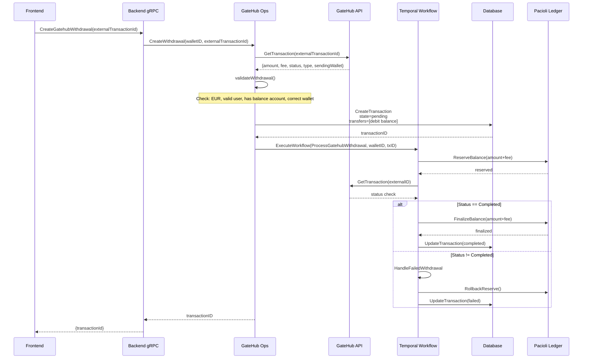
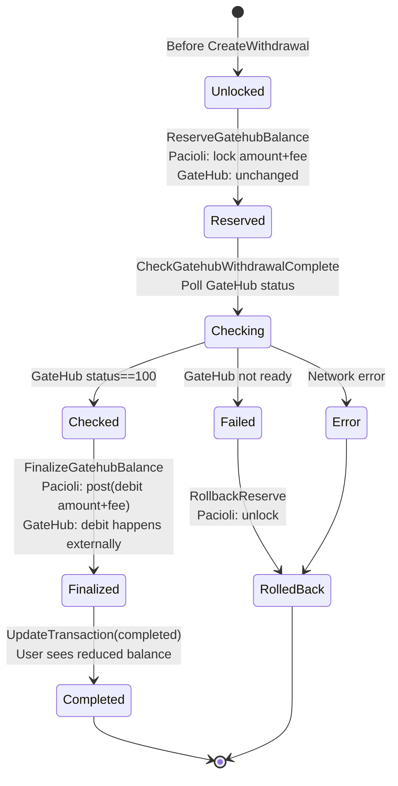

# GateHub Withdrawals Workflow

## Overview

This document describes how the Interledger App Wallet processes **GateHub-based withdrawals** for **EU-region users only**. Withdrawals allow users to move money from their wallet balance (held in GateHub custody) to an external bank account managed by GateHub.

**🚨 CRITICAL: Withdrawals vs. Deposits Architecture Difference**

| Aspect | Withdrawals | Deposits |
|--------|-------------|----------|
| **Webhook** | **\u274c NONE** | \u2705 Required |
| **Initiation** | Frontend RPC call | Webhook from provider |
| **Flow** | Iframe → postMessage → Frontend → Backend RPC → Workflow | Provider → Webhook → Workflow |
| **Transaction Type** | Type `0` (Withdrawal) | Type `1` (Deposit) |

**Why This Matters**: MockGateHub must NOT send webhooks for withdrawals (unlike deposits). The backend workflow is triggered by the frontend's `CreateGatehubWithdrawal` RPC call, not by a webhook. Sending a withdrawal webhook causes the workflow to start BEFORE the transaction exists in the database, resulting in "transaction not found" errors.

**Important**: The Interledger App supports multiple withdrawal providers based on user region:
- **EU users** → GateHub withdrawals (this document)
- **US users** → PTI withdrawals
- **Canadian users** → Chimoney withdrawals
- **Other regions** → Fynbos/Interledger withdrawals

**Key Differences:**
1. **From Deposits**: Withdrawals debit balance; deposits credit balance
2. **From P2P Payments**: Withdrawals have no receiver assignment (money leaves to external account)
3. **GateHub vs. Fynbos/PTI**: GateHub uses iframe widget with NO bank account linking required (GateHub manages external accounts). Fynbos/PTI require users to connect their bank accounts in the app first.

## Architecture: Withdrawal vs Deposit vs P2P

### Withdrawal Provider Selection

The backend determines which withdrawal provider to use based on the user's wallet country:

```go
// go/backend/grpc/deposit.go - GetOnOffRampProvider()
provider := "interledger"  // default
if country.EUCountries[w.Country] {
    provider = "gatehub"  // EU users
} else if country.CA == w.Country {
    provider = "chimoney"  // Canada
} else if country.US == w.Country {
    provider = "pti"  // United States
}
```

**Frontend Behavior**:
- `provider == "gatehub"` → Loads GateHub iframe widget (`GatehubWithdrawalPage`)
- Other providers → Loads frontend form (`FynbosWithdrawalPage`) which checks for linked bank accounts

```tsx
// typescript/protea/app/routes/withdraw.tsx
if (data.linkedAccounts.length === 0)
  return (
    <Card>
      <CardContent>
        <p>To withdraw from your balance, first connect a bank account.</p>
      </CardContent>
    </Card>
  )
```

**Critical**: This bank account check **only applies to Fynbos/PTI/Interledger withdrawals**, NOT GateHub. GateHub manages external bank accounts within their own system—users configure destination accounts directly in the GateHub iframe.

### Transaction Types Comparison

| Aspect | Withdrawal | Deposit | P2P Payment |
|--------|-----------|---------|------------|
| **Initiator** | User via UI | External bank | Wallet user (sender) |
| **Flow** | GateHub widget → Backend API | Webhook | Direct workflow |
| **Balance Operation** | Debit (reserve + finalize) | Credit (no reserve) | Debit sender + Credit receiver |
| **Provider API Calls** | `GetTransaction` (status check) | `POST /transactions` (hosted) | `POST /transactions` (hosted) |
| **Completion** | Provider wallet status polling | Webhook signals | Workflow signals |
| **Receiver** | External bank account | Wallet | Internal wallet |
| **Fee Behavior** | Total = Amount + Fee | Total = Amount (fee is metadata) | No fees (hardcoded 0) |
| **Pacioli Ledger** | Reserve → Finalize (2 steps) | No reserve (1 step) | Reserve → Finalize → Assign (3 steps) |

## Withdrawal User Journey

### Prerequisite: Bank Account Management

**GateHub**: External bank accounts are managed entirely within GateHub's system. Users configure withdrawal destinations (IBAN, SWIFT, etc.) through the GateHub withdrawal iframe itself. The Interledger App does NOT need to store or manage these bank account details.

**Fynbos/PTI**: Users must link their bank accounts in the Interledger App first (via `/accounts` page). These linked accounts are stored in the `linked_accounts` table and used as withdrawal destinations.

### Step 1: Load Withdrawal Page

User clicks "Withdraw" in the UI.

```tsx
// typescript/protea/app/routes/withdraw.tsx
// - Check user is authenticated
// - Check user is EU-based (GateHub requirement)
// - Load GateHub withdrawal widget URL
// - Load available bank accounts for withdrawal destination
```

**Backend RPC**: `GetGatehubWithdrawalWidget()` → Returns iframe URL

```
https://sandbox.gatehub.net/sandbox/withdraw?...
```

### Step 2: Submit via GateHub Widget

User fills in withdrawal details in the iframe:
- Amount to withdraw
- Destination bank account (from previously-linked accounts)
- Withdrawal confirmation

**IMPORTANT**: MockGateHub creates the withdrawal transaction immediately with:
- Transaction Type: `0` (Withdrawal - not Deposit type 1)
- Status: `100` (Completed)
- **NO WEBHOOK SENT** - Unlike deposits, withdrawals do not trigger webhooks

GateHub iframe processes the submission and responds with:
- `event.data.type === 'WithdrawalCompleted'`
- `event.data.uuid` (external transaction UUID from MockGateHub)

```tsx
// Iframe handler listens for: event.data.type === 'WithdrawalCompleted'
if (event.data.type === 'WithdrawalCompleted') {
  const externalTransactionId = event.data.uuid
  // Post form to /withdraw action with externalTransactionId
}
```

### Step 3: Create Withdrawal Transaction

The UI submits the withdrawal to the backend action handler:

```tsx
// Form submission from withdraw.tsx
post('/withdraw', {
  provider: 'gatehub',
  withdrawalId: event.data.uuid,  // External transaction ID from GateHub
})
```

**Backend RPC**: `CreateGatehubWithdrawal(externalTransactionId)`

## Backend Withdrawal Workflow

### High-Level Flow



### Step 1: Validate Withdrawal (`validateWithdrawal`)

The operation fetches the transaction from GateHub and performs validation:

```go
func validateWithdrawal(
  ctx, backends, externalClient, 
  walletID, externalTransactionID
) (amount, linkedAccount, fee, error)
```

**Validation Checks**:

1. **User exists**: Extract GateHub user ID from wallet
2. **Transaction exists**: `GetTransaction(externalUserID, externalTransactionID)`
3. **Type is withdrawal**: `transaction.Type == TransactionTypeWithdrawal`
4. **Currency is EUR**: `transaction.Vault.AssetCode == "EUR"` (GateHub EU region only)
5. **Wallet has balance account**: Find linked account with `provider=="gatehub"` and `type=="balance"`
6. **Withdrawal is from correct wallet**: `transaction.SendingWallet.Address == walletBalance.ProviderID`
7. **Extract fee**: Parse `transaction.Fee` from GateHub response

**Returns**: 
- `Amount` (the withdrawal amount, scaled to currency precision)
- `LinkedAccount` (the GateHub balance account to debit)  
- `Fee` (the GateHub transaction fee)

**Failure Example**: User tries to withdraw but doesn't have a GateHub EUR Balance account
```
Error: "Gatehub balance linked account not found"
```

### Step 2: Create Transaction Record

Once validation passes, create a transaction record:

```go
db.CreateTransaction({
  WalletID: walletID,
  ForeignID: externalTransactionID,  // GateHub's transaction ID
  Provider: "gatehub",
  State: "pending",
  ForeignType: "withdrawal",
  Source: walletAddress,
  Destination: walletAddress,
  Title: "Withdrawal",
  Amount: amount,                     // e.g., 50.00
  ProviderFee: fee,                   // e.g., 1.00
  Transfers: [{
    LinkedAccountID: balanceAccount.ID,
    Type: "debit_balance",
    State: "pending",
    Amount: amount,
  }]
})
```

**Key Fields**:
- `ForeignID`: Links to GateHub's transaction ID for status polling
- `ProviderFee`: Stores the GateHub fee (charged by GateHub, not the app)
- `Transfers`: Contains debit operation (no credit transfer like P2P)
- Initial state: `pending` (not yet debited from balance)

### Step 3: Start Workflow

Initiate async Temporal workflow to handle the withdrawal:

```go
func processWithdrawal(ctx, backends, walletID, transactionID) {
  workflow := StartWorkflow(
    ID: "gatehub_create_withdrawal_<transactionID>",
    TaskQueue: "backend",
    Workflow: ProcessGatehubWithdrawal,
    Args: (walletID, transactionID)
  )
}
```

### Step 4: Temporal Workflow (`ProcessGatehubWithdrawal`)

The workflow executes the withdrawal in phases:

#### Phase 1: Reserve Balance

```go
ReserveGatehubBalance(transactionID, walletID)
```

**What happens**:
- Look up transaction details from database
- Extract amount and fee
- Lock balance in Pacioli ledger: `reserve(amount + fee)` from user's EUR balance
- Provider balance unchanged (GateHub still shows full balance)

**Why reserve first**: Prevents overdraft — ensures user can't spend the amount elsewhere while withdrawal is pending.

#### Phase 2: Check Completion

```go
CheckGatehubWithdrawalComplete(walletID, transactionID)
```

**What happens**:
- Fetch transaction status from GateHub: `GetTransaction(externalUserID, foreignID)`
- Verify status == `100` (completed in GateHub)
- If status is pending (1), throw error to retry
- If status is failed (3), throw error to trigger failure handler

**Polling Method**: This is a one-time check. The workflow assumes GateHub has processed the withdrawal by this point. In real GateHub:
- Withdrawal submission to bank is immediate
- Bank processing happens asynchronously
- GateHub updates status when bank confirms

**For MockGateHub**: The transaction is created with `status=100` immediately, simulating fast completion.

#### Phase 3: Finalize Balance

```go
FinalizeGatehubBalance(transactionID, walletID)
```

**What happens**:
- Commit the reserved balance: Create Pacioli ledger "post" transfer
- Move balance from "reserved" to "finalized"
- User's EUR balance is now permanently reduced by (amount + fee)

**Example**:
```
Before: 1000.00 EUR reserved, 0 EUR finalized
After:  0 EUR reserved, 1000.00 EUR finalized (committed)
```

#### Phase 4: Update Transaction State

```go
UpdateGatehubWithdrawalState(walletID, transactionID, "completed")
```

**What happens**:
- Mark transaction as `completed` in database
- Triggers balance display update in frontend

**Error Handling**: If any phase fails, `handleFailedWithdrawal` is called:
```go
func handleFailedWithdrawal(ctx, activity, walletID, txID) {
  // 1. Rollback reserved balance
  RollbackReserve(txID)
  
  // 2. Update transaction to "failed"
  UpdateTransaction(txID, "failed")
  
  // 3. Send notification (optional)
}
```

## Balance State Machine

Withdrawal progresses through these balance states:



## Key Differences from Deposits

| Aspect | Withdrawal | Deposit |
|--------|-----------|---------|
| **Reserve Phase** | Required (prevent overdraft) | Not used |
| **Webhook** | **❌ NONE** - Frontend-initiated RPC flow | ✅ Webhook drives completion |
| **Provider API Call** | `GetTransaction` (validate status) | `POST /transactions` (create hosted) |
| **Initiation** | User iframe → Frontend RPC → Backend | External source → Webhook → Backend |
| **Receiver** | None (external account) | User's wallet (internal) |
| **Total Amount** | amount + fee (what's debited) | amount only (fee is metadata) |
| **Balance Change** | Immediate (post finalize) | Delayed (webhook triggers assign) |
| **Timing** | Fast (mins to hours bank side) | Immediate (internal transfer) |

## Database Schema

### transactions table

```sql
-- Key fields for withdrawals
id UUID PRIMARY KEY,
wallet_id UUID,
foreign_id VARCHAR,              -- GateHub transaction ID (used for polling)
provider VARCHAR,                 -- 'gatehub'
state VARCHAR,                    -- 'pending' → 'completed' or 'failed'
foreign_type VARCHAR,             -- 'withdrawal'
provider_fee BIGINT,              -- e.g., 100 (€1.00, scale=2)
amount BIGINT,                    -- e.g., 5000 (€50.00, scale=2)
transfers JSONB                   -- [{type: 'debit_balance', ...}]
```

### transfers table

```sql
-- One row per withdrawal
id UUID PRIMARY KEY,
transaction_id UUID,
linked_account_id UUID,           -- EUR Balance account
type VARCHAR,                     -- 'debit_balance'
state VARCHAR,                    -- 'pending' → 'completed'
amount BIGINT,                    -- withdrawal amount
```

### Pacioli (Balance Ledger)

```
CREATE POST (debit) transfer:
  account: user's EUR balance
  amount: withdrawal_amount + fee
  status: 'posted'
  timestamp: completion time

Example: 
  User balance: 1000.00 EUR
  Withdrawal: 50.00 EUR
  Fee: 1.00 EUR
  Post transfer: 51.00 EUR debit
  New balance: 949.00 EUR
```

## Fee Handling in Withdrawals

### Fee Extraction

The fee is obtained directly from GateHub's transaction response:

```go
// From validateWithdrawal()
fee, err := StringToScaledUInt(trx.Fee)  // "1.00" → 100 (scaled)
```

**Who charges the fee**: GateHub charges the withdrawal fee. The fee is deducted from the user's balance **in addition to** the withdrawal amount.

### Fee Display

**Frontend** (hardcoded):
```tsx
<span className='text-medium'>0.00</span>  // Always shows "0.00"
// Text: "For a limited time, the Interledger Wallet will absorb all fees"
```

**Backend** (accurate):
Store the actual fee from GateHub in `transaction.provider_fee`. The fee is **not** displayed on initiation (hardcoded as 0.00 in frontend), but the backend correctly deducts it.

**Transaction Details** (accurate):
Once completed, transaction detail screens show the actual fee:
```
Withdrawal Amount: 50.00 EUR
Fee: 1.00 EUR
Net Impact: -51.00 EUR
```

## Withdrawal Status Codes

GateHub transactions return these statuses:

| Code | Meaning | Workflow Response |
|------|---------|------------------|
| `1` | Pending | Retry (workflow retries) |
| `100` | Completed | Proceed to finalize |
| `3` | Failed | Rollback and error |

**MockGateHub Default**: Creates transactions with status `100` immediately, simulating instant completion.

## Withdrawal Failure Scenarios

### Scenario 1: User Lacks GateHub Balance Account

**Trigger**: User never completed GateHub onboarding

```
validateWithdrawal() → "Gatehub balance linked account not found"
Response: 404 Not Found
```

**Recovery**: User must complete KYC and link their GateHub EUR balance account first.

### Scenario 2: Insufficient Balance (Pacioli Reserve Fails)

**Trigger**: User tries to withdraw 1000 EUR but only has 500 EUR

```
ReserveGatehubBalance() → Reserve fails
Workflow: handleFailedWithdrawal() called
State: transaction marked 'failed'
Response: Error to frontend
```

**Note**: This is caught during the **reserve** phase before GateHub processes anything.

### Scenario 3: Withdrawal Pending in GateHub

**Trigger**: Bank hasn't confirmed withdrawal yet (rare, but possible)

```
CheckGatehubWithdrawalComplete() → status != 100
Workflow: Retry loop (up to 20 minutes in real Temporal)
```

**MockGateHub**: Completes instantly, so this shouldn't happen locally.

### Scenario 4: Currency Mismatch

**Trigger**: User attempts to withdraw in non-EUR currency

```
validateWithdrawal() → "Invalid currency"
Response: 400 Bad Request
```

**Reason**: Current implementation only supports EUR via GateHub in the EU.

## Integration with MockGateHub

### GateHub Withdrawal Provider (EU Only)

MockGateHub provides the GateHub iframe widget for withdrawals, matching GateHub sandbox behavior:

**Widget URL Format**:
```
https://mockgatehub.interledger.test/?paymentType=withdrawal&bearer={token}
```

**Backend RPC**: `GetGatehubWithdrawalWidget()` generates this URL with an authorization token.

**Important**: The withdrawal iframe lets users enter:
- Withdrawal amount
- Destination bank account (IBAN/SWIFT) - managed by GateHub, NOT stored in Interledger App
- Withdrawal confirmation

Once submitted, the iframe posts `{ type: 'WithdrawalCompleted', uuid: 'tx-id' }` to the parent window.

### Withdrawal Flow Without Bank Account Linking

Unlike Fynbos/PTI withdrawals, GateHub withdrawals work as follows:

1. Frontend loads GateHub withdrawal iframe (token-authenticated)
2. User enters amount and selects/enters destination bank account **inside the iframe**
3. **MockGateHub processes the withdrawal request immediately**:
   - Creates transaction with `type: 0` (Withdrawal)
   - Deducts balance from user's MockGateHub account
   - Returns transaction ID to iframe
   - **❌ NO WEBHOOK SENT** (critical difference from deposits)
4. Iframe sends `WithdrawalCompleted` postMessage to parent window with transaction ID
5. Frontend receives message and calls `CreateGatehubWithdrawal(transactionID)` backend RPC
6. Backend fetches transaction from MockGateHub via `GetTransaction` API
7. Backend validates transaction (type==0, currency==EUR, correct wallet)
8. Backend creates transaction record in database and starts Temporal workflow
9. Workflow reserves balance in Pacioli ledger, verifies completion, finalizes balance

**No `linked_accounts` table involvement** - bank account details stay within GateHub's system.
**No webhook-based flow** - entirely frontend-initiated RPC call triggers backend workflow.

### Withdrawal Transaction Creation in MockGateHub

When the iframe submits a withdrawal via `/transaction/complete?paymentType=withdrawal`:

**What MockGateHub Does**:
1. Extracts user from bearer token
2. Validates amount and currency
3. Checks user has sufficient balance (amount + fee)
4. Creates transaction with **Type 0** (Withdrawal):
   ```go
   tx := &models.Transaction{
     Type:        0,  // TransactionTypeWithdrawal (NOT 1 for deposit)
     DepositType: "withdrawal",
     Status:      100, // Completed immediately
     Amount:      "50.00",
     Fee:         "1.00",
     TotalAmount: "51.00",
     Currency:    "EUR",
     VaultUUID:   "a09a0a2c-1a3a-44c5-a1b9-603a6eea9341",
   }
   ```
5. Deducts balance from user's account (amount + fee)
6. **❌ Does NOT send webhook** (critical difference from deposits)
7. Returns transaction ID to iframe

**GetTransaction Response Format** (for backend validation):
```json
{
  "uuid": "tx-uuid",
  "amount": "50.00",
  "total_amount": "51.00",
  "fee": "1.00",
  "status": 100,
  "type": 0,
  "deposit_type": "withdrawal",
  "currency": "EUR",
  "vault": {
    "uuid": "a09a0a2c-1a3a-44c5-a1b9-603a6eea9341",
    "asset_code": "EUR",
    "name": "EUR Vault"
  },
  "sending_wallet": {
    "address": "rJEnPMAYNvtA4QLBCqExGtpDBj3FSeoN9S"
  },
  "receiving_wallet": {
    "address": "rJEnPMAYNvtA4QLBCqExGtpDBj3FSeoN9S"
  }
}
```

**Critical Fields for Backend Validation**:
- `type` must be `0` (backend checks `trx.Type != external.TransactionTypeWithdrawal`)
- `vault.asset_code` must be `"EUR"` (backend checks currency)
- `sending_wallet.address` must match user's GateHub wallet address
- `status` should be `100` (completed)

### Key Implementation Details

**Transaction Type**: 
- Withdrawals use `type: 0` (TransactionTypeWithdrawal)
- Deposits use `type: 1` (TransactionTypeDeposit)  
- Hosted transfers use `type: 2` (TransactionTypeHosted)

**Status Code**:
- Withdrawals complete immediately with status `100` (matching GateHub's completed state)
- In real GateHub, status may progress through pending states (1) before completing

**No Webhook Delivery**:
- MockGateHub does NOT send `core.withdrawal.completed` webhook
- This matches real GateHub behavior - withdrawals are frontend-initiated
- Only deposits send webhooks (`core.deposit.completed`)

**Response Format**:
- Must include nested `vault` object with `asset_code` field
- Must include `sending_wallet` and `receiving_wallet` objects
- Backend validation fails if these nested objects are missing

## Testing Withdrawals

### Manual Test Flow

1. **Setup**:
   ```bash
   # Set withdrawal fee to 2%
   curl -X PUT http://localhost:8080/admin/fees \
     -H "Content-Type: application/json" \
     -d '{"withdrawal_fee_percentage": 2.0}'
   ```

2. **Create User & Link Account**:
   ```bash
   # Create user
   curl -X POST http://localhost:8080/id/v1/users \
     -d '{"email": "user@example.com"}'
   
   # Get onboarding widget
   curl http://localhost:8080/...?paymentType=onboarding
   
   # Submit KYC via iframe
   curl -X POST http://localhost:8080/iframe/submit \
     -F "status=approved" \
     -F "user_id=..." \
     # User status becomes "accepted"
   
   # Balance account auto-created via webhook
   ```

3. **Create Withdrawal**:
   ```bash
   # Simulate GateHub withdrawal request
   curl -X POST http://localhost:8080/core/v1/transactions \
     -H "Content-Type: application/json" \
     -d '{
       "user_id": "user-uuid",
       "type": 3,
       "deposit_type": "withdrawal",
       "amount": 50.00,
       "currency": "EUR"
     }'
   
   # Response:
   # {
   #   "uuid": "tx-uuid",
   #   "amount": "50.00",
   #   "fee": "1.00",
   #   "total_amount": "51.00",
   #   "status": 100
   # }
   ```

4. **Verify Status**:
   ```bash
   curl http://localhost:8080/core/v1/transactions/tx-uuid
   ```

### E2E Test with Interledger App

```go
// testenv/godog_test.go
Feature: Withdrawal
  Scenario: User withdraws EUR with fee
    Given user is verified in GateHub
    And user has EUR balance account with 1000.00 EUR
    And withdrawal fee is configured to 2%
    When user creates withdrawal of 100.00 EUR
    Then transaction is created with:
      - amount: "100.00"
      - fee: "2.00"
      - total_amount: "102.00"
    And user balance is reduced by 102.00 EUR (to 898.00)
    And transaction status is completed
```

## Troubleshooting

### Issue: "To withdraw from your balance, first connect a bank account"

**Cause**: User is seeing the Fynbos/PTI withdrawal form instead of the GateHub iframe

**Root Causes**:
1. **Wrong Provider**: User's wallet country is NOT in EU → Backend returns `provider: "interledger"` or `provider: "pti"`
2. **Missing Country**: Wallet created without proper country code → Defaults to non-EU provider

**Fix for EU Users**:
1. Verify wallet country is set correctly in database (e.g., `"DE"` for Germany)
2. Confirm `GetOnOffRampProvider()` returns `"gatehub"` for this user
3. Check frontend loads `GatehubWithdrawalPage` (iframe) not `FynbosWithdrawalPage` (form)4. Ensure user completed KYC and has EUR balance account

**Fix for Non-EU Users**:
This is expected behavior! Non-EU users must:
1. Navigate to `/accounts` page
2. Click "Connect bank account"
3. Follow bank linking flow (provider-specific: Plaid for PTI, manual for Fynbos)
4. Return to withdrawal page - form will now show connected account

**Debug**:
```bash
# Check user's wallet country
psql wallet_backend -c "
  SELECT w.id, w.country, u.email
  FROM wallets w
  JOIN user_wallets uw ON uw.wallet_id = w.id
  JOIN users u ON u.id = uw.user_id
  WHERE u.email = 'user@example.com';"

# Check provider selection
curl -H "Cookie: ory_kratos_session=..." \
  https://interledger.test/api/backend.BackendService/GetOnOffRampProvider

# Expected for EU: {"provider": "gatehub"}
# Expected for US: {"provider": "pti"}
```

### Issue: "Gatehub balance linked account not found"

**Context**: This error applies to **backend withdrawal processing**, NOT frontend page loading

**Cause**: User hasn't completed GateHub onboarding workflow

**When This Occurs**:
- Frontend successfully loads GateHub iframe
- User completes withdrawal in iframe
- Frontend calls `CreateGatehubWithdrawal(txID)` on backend- Backend's `validateWithdrawal()` checks for EUR balance linked account
- Check fails because KYC webhook never created the balance account

**Fix**:
1. User completes onboarding on GateHub widget
2. System receives `id.verification.accepted` webhook
3. Workflow `LinkGatehubUserToGateway` creates EUR balance account
4. Retry withdrawal

**Debug**:
```bash
# Check linked accounts
curl http://localhost:status/admin/wallets/{wallet_id}/linked_accounts

# Check if balance account exists
curl http://localhost/admin/linked_accounts?wallet_id={wallet_id}&provider=gatehub&type=balance
```

### Issue: Workflow fails with "Transaction is not a withdrawal"

**Cause**: MockGateHub created transaction with wrong type

**Symptoms**:
```
backend: "gatehub: internal error Transaction is not a withdrawal"
```

**Root Cause**: Transaction created with `type: 1` (Deposit) instead of `type: 0` (Withdrawal)

**Fix**: Verify MockGateHub creates withdrawals with correct type:
```bash
# Check transaction type in MockGateHub
curl http://localhost:8080/core/v1/transactions/{tx_uuid} | jq '.type'
# Must return: 0 (not 1)
```

### Issue: Workflow fails with "Invalid currency"

**Cause**: Transaction response missing nested `vault.asset_code` field

**Symptoms**:
```
backend: "gatehub: internal error Invalid currency"
```

**Root Cause**: Backend expects `trx.Vault.AssetCode` but MockGateHub returned flat structure

**Fix**: Verify GetTransaction response includes:
```json
{
  "vault": {
    "asset_code": "EUR"
  },
  "sending_wallet": { "address": "..." }
}
```

### Issue: Workflow stuck in polling

**Cause**: GateHub transaction status not returning 100

**Fix**:
1. Verify MockGateHub returns `status: 100` in GetTransaction response
2. Check Temporal workflow logs for GetGatehubTransfer activity
3. For production GateHub, withdrawal may genuinely be pending (bank processing)

**Debug**:
```bash
# Check transaction status in MockGateHub
curl http://localhost:8080/core/v1/transactions/{tx_uuid}

# Check Temporal workflow status
temporal workflow describe --workflow-id "gatehub_create_withdrawal_{tx_id}"
```

### Issue: Workflow starts before frontend RPC call

**Cause**: MockGateHub incorrectly sending withdrawal webhook

**Symptoms**:
```
backend: "Activity error: Transaction not found"
backend: "Activity error: Gatehub withdrawal not found"
```

**Root Cause**: Webhook triggers workflow BEFORE frontend creates DB record

**Fix**: Remove withdrawal webhook from MockGateHub `processWithdrawal()` function. Withdrawals should NOT send webhooks - only frontend RPC call should trigger workflow.

### Issue: Balance not updated after completion

**Cause**: Workflow completed but balance not debited

**Possible reasons**:
1. Database transaction not committed
2. Pacioli post transfer failed
3. Transaction state not updated to "completed"

**Debug**:
```bash
# Check transaction state in database
psql wallet_backend -c "
  SELECT id, state, provider_fee FROM transactions 
  WHERE id = '{tx_id}';"

# Check Pacioli ledger for debit post
psql wallet_backend -c "
  SELECT * FROM accounts 
  WHERE user_id = '{wallet_id}' 
  AND currency = 'EUR';"

# Check workflow execution
temporal workflow describe --workflow-id "gatehub_create_withdrawal_{tx_id}"
```

## Differences from Real GateHub

MockGateHub simplifies withdrawal processing for local development:

| Aspect | Real GateHub | MockGateHub |
|--------|------------|-------------|
| **Processing Time** | Minutes to hours (bank dependent) | Instant |
| **Fee Variability** | Per-transaction, per-bank | Fixed percentage |
| **Status Progression** | 1 → (pending states) → 100 | Immediately 100 |
| **Webhook Delivery** | **\u274c None for withdrawals** | **\u274c None** (\u2705 Matches real behavior) |
| **Bank Validation** | Real bank account verification | Simulated |
| **Transaction Type** | Type `0` for withdrawals | Type `0` (\u2705 Correct) |
| **Response Format** | Nested vault/wallet objects | Nested objects (\u2705 Correct) |
| **Error Handling** | Real bank errors (IBAN invalid, etc.) | Simplified |

**Key Learning**: During development (Feb 18, 2026), MockGateHub initially sent `core.withdrawal.completed` webhooks, but this was incorrect. Real GateHub does NOT send withdrawal webhooks - the flow is entirely frontend-initiated via RPC. Sending webhooks caused race conditions where the workflow started before the database transaction existed.

## References

- **Backend Ops**: [go/backend/providers/gatehub/ops/ops.go](../../../interledger-app/go/backend/providers/gatehub/ops/ops.go) - `CreateWithdrawal`, `validateWithdrawal`, `processWithdrawal`
- **Workflow**: [go/backend/providers/gatehub/ops/workflows.go](../../../interledger-app/go/backend/providers/gatehub/ops/workflows.go) - `ProcessGatehubWithdrawal`
- **Activities**: [go/backend/providers/gatehub/ops/activity.go](../../../interledger-app/go/backend/providers/gatehub/ops/activity.go) - `ReserveGatehubBalance`, `CheckGatehubWithdrawalComplete`, `FinalizeGatehubBalance`
- **Frontend**: [typescript/protea/app/routes/withdraw.tsx](../../../interledger-app/typescript/protea/app/routes/withdraw.tsx)
- **MockGateHub**: [internal/handler/core.go](../handler/core.go) - `CreateTransaction` with `deposit_type=="withdrawal"`
- **Fees**: [docs/gatehub-transaction-fees.md](gatehub-transaction-fees.md)

---

**Last Updated**: February 18, 2026  
**Related Documents**: [gatehub-payments.md](gatehub-payments.md), [gatehub-transaction-fees.md](gatehub-transaction-fees.md)

**Recent Updates**:
- **Feb 18, 2026**: Documented critical webhook behavior (withdrawals do NOT send webhooks), correct transaction type (0 not 1), and proper response format with nested objects. Added troubleshooting for common implementation errors discovered during E2E test debugging.
