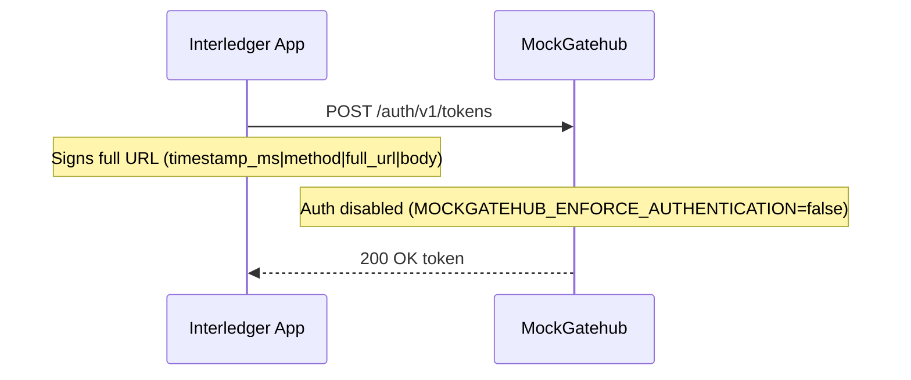
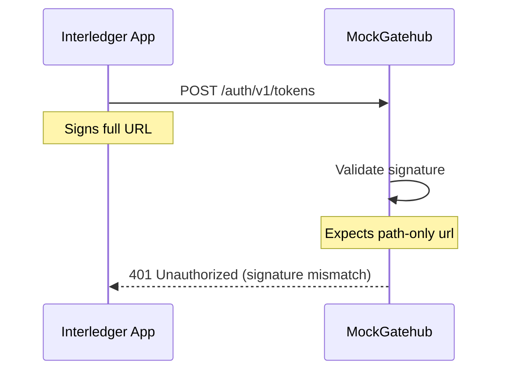
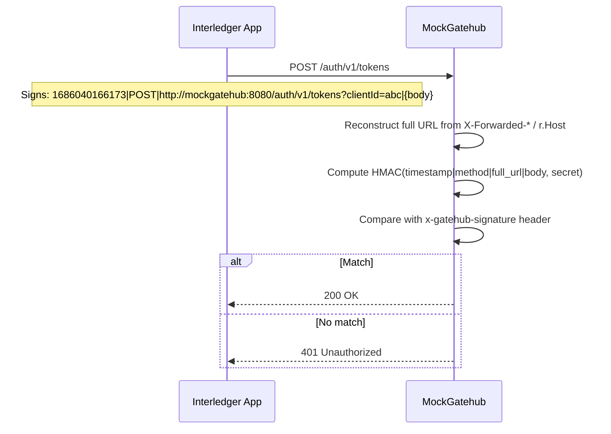

# MockGatehub HMAC Signature Enforcement

## Summary

MockGatehub has a feature flag, `MOCKGATEHUB_ENFORCE_AUTHENTICATION`, that toggles HMAC request verification for all non-public endpoints. The Interledger App e2e environment disables this because the Interledger App Gatehub client signs requests differently than MockGatehub currently validates them. The mismatch causes 401 responses from MockGatehub, which breaks the Gatehub flows during e2e runs.

This document explains the mismatch, why the e2e tests need the flag off today, and proposes changes in MockGatehub so its behavior aligns with real Gatehub and the Interledger App client.

## Where The Flag Is Used

- MockGatehub config reads `MOCKGATEHUB_ENFORCE_AUTHENTICATION` with a default of `true` in [internal/config/config.go](internal/config/config.go#L1).
- The middleware enforces signatures when the flag is enabled in [cmd/mockgatehub/main.go](cmd/mockgatehub/main.go#L1).
- Local e2e environment explicitly disables auth in [interledger-app/local/mockgatehub.yaml](../interledger-app/local/mockgatehub.yaml#L1).

## Current MockGatehub Signature Rules

MockGatehub validates signatures in [internal/auth/middleware.go](internal/auth/middleware.go#L1) using `ValidateSignatureWithAppID` and accepts either:

1) Simple format:

- `HMAC-SHA256(timestamp + method + path + body, secret)`

2) Gatehub backend format (as implemented by MockGatehub):

- `HMAC-SHA256(timestamp_ms|method|url|body, secret)`
- `url` is derived from `r.URL.Path` (plus query string when present)

See [internal/auth/signature.go](internal/auth/signature.go#L1) and [internal/auth/middleware.go](internal/auth/middleware.go#L1).

## Interledger App Gatehub Client Signature Rules

The Interledger App Gatehub client signs requests in [go/backend/providers/gatehub/external/client.go](../interledger-app/go/backend/providers/gatehub/external/client.go#L1) with:

- `HMAC-SHA256(timestamp_ms|method|full_url|body, secret)`
- `full_url` is the absolute URL used for the request (scheme + host + path + query)
- timestamp is in **milliseconds**

This is the only signature format the Interledger App client produces for Gatehub requests.

## Why e2e Fails When Auth Is Enforced

The mismatch is in the `url` component of the signature base string:

- Interledger App signs the **full URL** (example: `http://mockgatehub:8080/auth/v1/tokens?clientId=...`).
- MockGatehub validates using **path + query only** (example: `/auth/v1/tokens?clientId=...`).

These produce different HMACs, so MockGatehub returns 401 and the e2e tests fail before they can complete the Gatehub flows.

There is also a format divergence that can appear in other integrations:

- MockGatehub supports a "simple" signature format that real Gatehub does not use.
- Timestamp windows are not enforced in the middleware (no 5-minute check), while Gatehub may enforce time skew.

The local e2e environment disables auth explicitly to unblock the flows, as noted in [interledger-app/local/mockgatehub.yaml](../interledger-app/local/mockgatehub.yaml#L1).

## Sequence Diagram: Current Local e2e Flow (Auth Disabled)



## Sequence Diagram: Current Local e2e Flow (Auth Enabled)



## Why We Need The Feature Flag Today

- The Interledger App client is already aligned with real Gatehub signature conventions (timestamp in ms, full URL in the base string).
- MockGatehub currently validates against a different `url` input (path + query only).
- The e2e tests use the same backend client that would call real Gatehub, so they naturally fail against MockGatehub unless validation is disabled.

In short, the flag exists to allow e2e tests to run despite this mismatch.

## Implementation Plan

The goal is to make MockGatehub validate signatures identically to real Gatehub: `HMAC-SHA256(timestamp_ms|method|full_url|body, secret)`, using the full absolute URL. The "simple" concatenation format (`timestamp + method + path + body` with no delimiter) will be removed entirely — it was a MockGatehub-only invention that real Gatehub does not support, and no known client produces it.

### What The Official Gatehub Docs Say

From [Gatehub Authentication](https://docs.gatehub.net/api-documentation/c3OPAp5dM191CDAdwyYS/basics/authentication):

- **Base string**: `timestamp|request_method|original_url|post_body` (pipe-delimited, 3-4 components).
- **`original_url`**: "the full requested URL, with all its complementary parameters" — i.e. including scheme and host.
- **Timestamp**: The docs describe `x-gatehub-timestamp` as "current UNIX timestamp (UTC)" without specifying units, but their examples use millisecond values (e.g. `1686040166173`). The Interledger App client uses `date.UnixMilli()` for both the base string and the header value.
- **Example**: `1686040166173|GET|https://api.sandbox.gatehub.net/core/v1/wallets/851414319/balances`
- **Trailing component**: `post_body` is omitted (not present, not an empty string) for GET requests or when the body is empty.

**Critical: timestamp handling in validation.** The `x-gatehub-timestamp` header value must be used **verbatim** in the signature base string. The client puts the same value in both the header and the HMAC input. MockGatehub must not normalize or convert the timestamp (e.g. dividing milliseconds by 1000 to get seconds) before computing the expected signature. The existing `NormalizeTimestamp` function does this conversion and is used only by the unused `ValidateSignature` function — both should be removed.

Both `strings.Trim(base, "|")` in MockGatehub and the Interledger App client already handle this — trimming a trailing pipe when body is empty produces the correct 3-component string.

### Changes Required

#### 1. `internal/auth/signature.go`

| Change | Detail |
|--------|--------|
| Remove `GenerateSignature` | Delete the simple-format function. All callers will use the Gatehub format. |
| Keep `GenerateGatehubSignature` | Rename to `GenerateSignature` (it becomes the only format). Signature unchanged: `timestamp_ms\|method\|url\|body` with `strings.Trim`. |
| Remove `ValidateSignature` | This standalone function (with the 5-minute window) is never called by the middleware. Delete it. |
| Remove `NormalizeTimestamp` | Only used by the deleted `ValidateSignature`. Delete it. |
| Keep `SignRequest` | Update to use millisecond timestamps and the Gatehub format. |
| Keep `GenerateGateHubWebhookSignature` | Unchanged — webhook signing is a separate concern. |

#### 2. `internal/auth/middleware.go`

| Change | Detail |
|--------|--------|
| Reconstruct full URL | Build the absolute URL from the incoming request before validating. Use `X-Forwarded-Proto` / `X-Forwarded-Host` headers (set by Traefik) when present, falling back to `r.URL.Scheme` / `r.Host` and ultimately to `http`. |
| Validate one format only | Compute `GenerateSignature(timestamp, method, fullURL, body, secret)` and compare. No fallback to path-only. |
| Keep path-only as logged fallback (temporary) | During the transition, if full-URL validation fails, also try path-only and **log a deprecation warning** if it matches. This eases rollout but can be removed in a future release. |

URL reconstruction logic:

```go
func reconstructURL(r *http.Request) string {
    scheme := r.Header.Get("X-Forwarded-Proto")
    if scheme == "" {
        if r.TLS != nil {
            scheme = "https"
        } else {
            scheme = "http"
        }
    }

    host := r.Header.Get("X-Forwarded-Host")
    if host == "" {
        host = r.Host
    }

    fullURL := scheme + "://" + host + r.URL.Path
    if r.URL.RawQuery != "" {
        fullURL += "?" + r.URL.RawQuery
    }
    return fullURL
}
```

#### 3. `internal/auth/signature_test.go`

| Change | Detail |
|--------|--------|
| Remove simple-format tests | Delete any test cases for the old `GenerateSignature` concatenation format. |
| Add full-URL test cases | Test that signing with a full URL like `http://mockgatehub:8080/auth/v1/tokens?clientId=abc` produces the expected HMAC. |
| Add URL reconstruction tests | Unit-test `reconstructURL` with various combinations of `X-Forwarded-*` headers, `r.Host`, and `r.TLS`. |
| Test pipe trimming | Verify that GET requests (no body) produce a 3-component base string without a trailing pipe. |

#### 4. `cmd/mockgatehub/main.go`

No changes needed. The middleware is already wired via `auth.Middleware(cfg.ValidCredentials)` and the `EnforceAuthentication` flag continues to control whether it runs.

#### 5. MockGatehub's own e2e tests (`testenv/`)

The test client in `testenv/client.go` generates HMAC headers for its requests. Update it to sign using the full URL (the URL it actually sends the request to) instead of path-only.

#### 6. Interledger App local environment

Once deployed, flip `MOCKGATEHUB_ENFORCE_AUTHENTICATION` back to `"true"` (or remove the override entirely, since `true` is the default) in [interledger-app/local/mockgatehub.yaml](../interledger-app/local/mockgatehub.yaml).

### Sequence Diagram: After Implementation



### Verification Criteria

The implementation is complete when:

1. All MockGatehub unit tests pass (`go test ./internal/...`).
2. All MockGatehub e2e tests pass (`go test ./testenv/...`) with authentication **enabled**.
3. The Interledger App local e2e tests pass with `MOCKGATEHUB_ENFORCE_AUTHENTICATION=true`.
4. `GenerateSignature` (old simple format) no longer exists in the codebase.
5. Feature scenarios in `features/signature_authentication.feature` all pass.

See [features/signature_authentication.feature](../features/signature_authentication.feature) for the BDD scenarios that cover the acceptance criteria.
